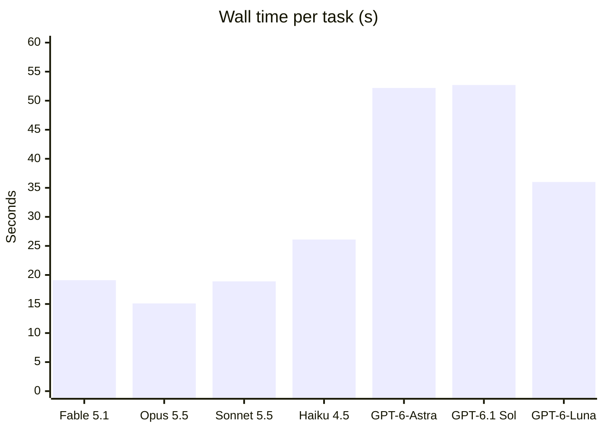
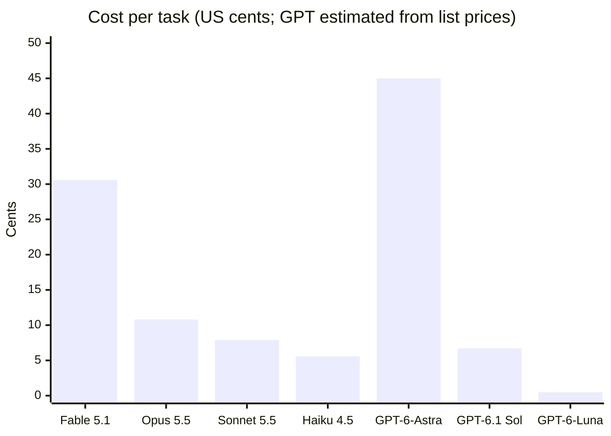
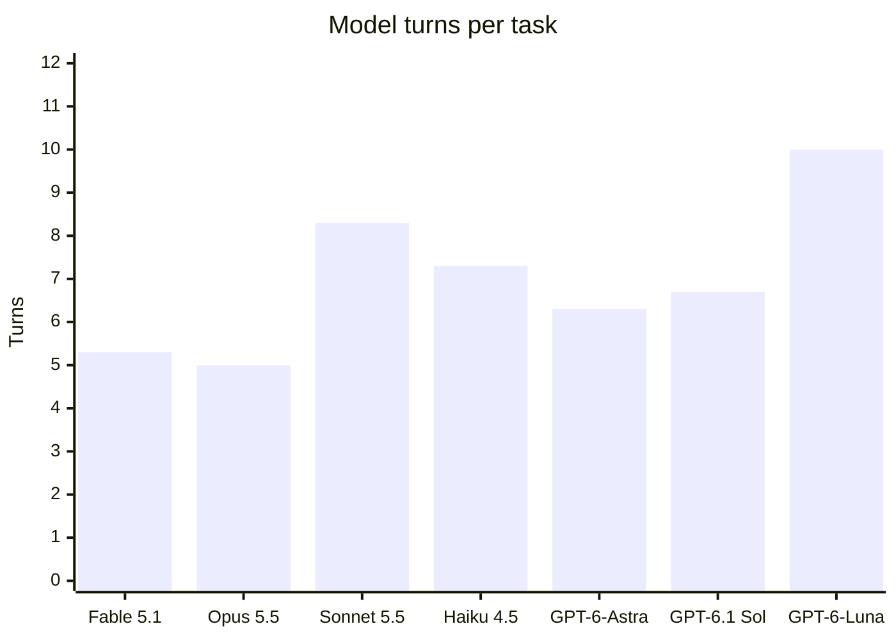
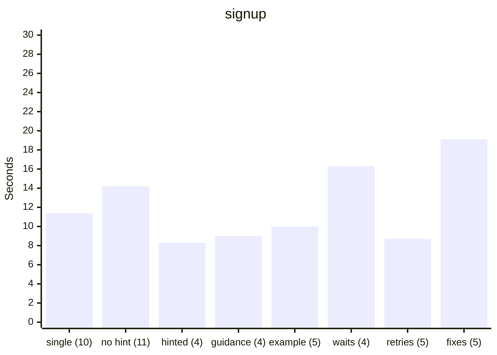
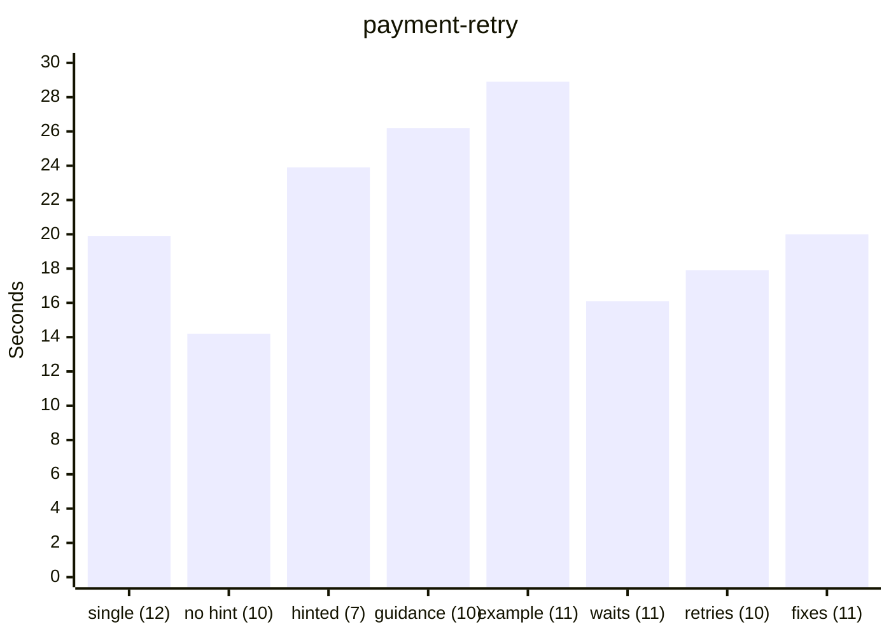
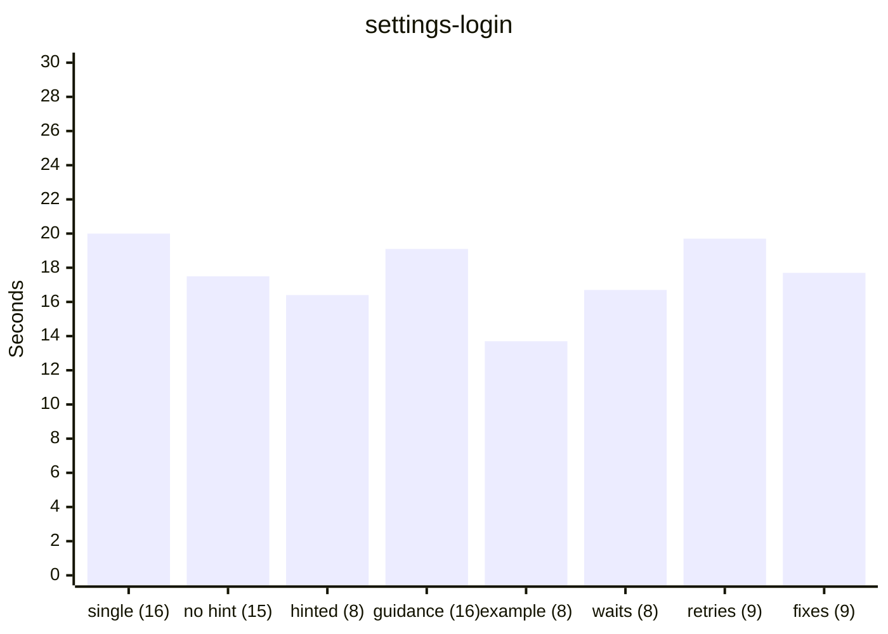
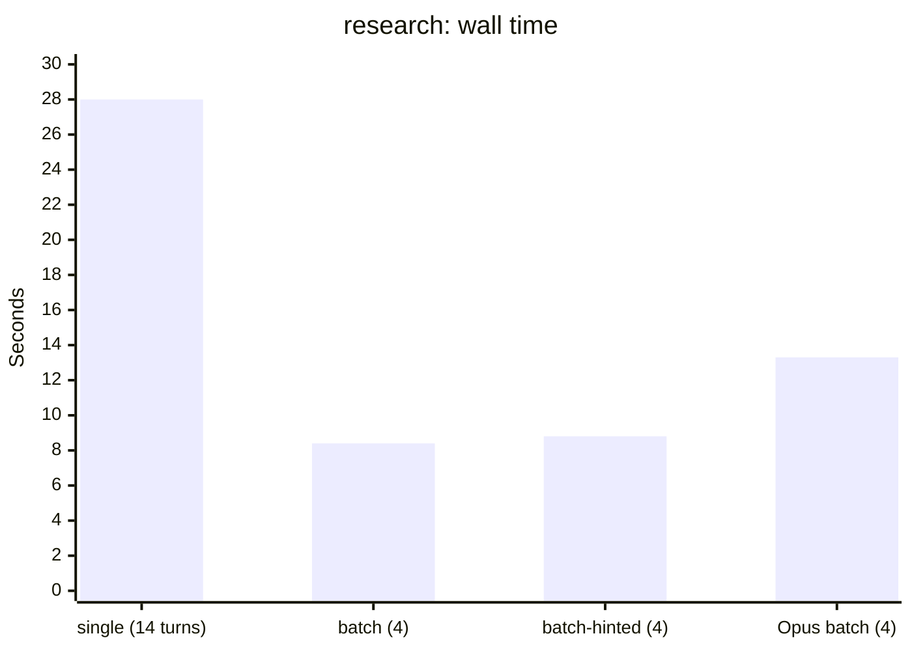

# Performance

How fast an AI agent finishes browser tasks through this MCP server, and what it costs. The model comparison and the effect of each server change come first; the method, the scenarios, and every run's full numbers follow.

## Model comparison

Seven models at medium effort, `batch` mode, 3 runs per scenario: 63 of 63 runs passed. Each value is the average over the three scenarios of that scenario's median. Five models ran on `c853f22`; Fable 5.1 and GPT-6-Astra ran later on `36ca114`, which has the same server and runner code apart from Astra's price. Claude models ran through Claude Code and GPT models through the Codex CLI, so each result covers the model and its CLI together; see [Method](#method).







| Model       | Via         | Wall time | Turns | Cost     | `signup`              | `payment-retry`        | `settings-login`       |
| ----------- | ----------- | --------- | ----- | -------- | --------------------- | ---------------------- | ---------------------- |
| Fable 5.1   | Claude Code | 19.1 s    | 5.3   | $0.306   | 15.5 s · 5 · $0.306   | 16.2 s · 4 · $0.237    | 25.6 s · 7 · $0.376    |
| Opus 5.5    | Claude Code | 15.1 s    | 5.0   | $0.108   | 12.5 s · 4 · $0.094   | 13.3 s · 4 · $0.084    | 19.5 s · 7 · $0.145    |
| Sonnet 5.5  | Claude Code | 18.9 s    | 8.3   | $0.079   | 19.1 s · 5 · $0.058   | 20.0 s · 11 · $0.077   | 17.7 s · 9 · $0.103    |
| Haiku 4.5   | Claude Code | 26.1 s    | 7.3   | $0.056   | 18.9 s · 5 · $0.044   | 28.6 s · 7 · $0.052    | 31.0 s · 10 · $0.072   |
| GPT-6-Astra | Codex CLI   | 52.2 s    | 6.3   | $0.450\* | 25.5 s · 4 · $0.381\* | 50.5 s · 7 · $0.448\*  | 80.5 s · 8 · $0.521\*  |
| GPT-6.1 Sol | Codex CLI   | 52.7 s    | 6.7   | $0.067\* | 46.0 s · 6 · $0.076\* | 53.2 s · 7 · $0.060\*  | 58.8 s · 7 · $0.067\*  |
| GPT-6-Luna  | Codex CLI   | 36.0 s    | 10.0  | $0.005\* | 33.7 s · 8 · $0.005\* | 37.3 s · 12 · $0.005\* | 37.0 s · 10 · $0.006\* |

\* Estimated from OpenAI's standard list prices, because Codex under a ChatGPT login reports tokens but no cost.

1. **Fable 5.1 and Opus 5.5 need the fewest turns, and only they used `repeat`.** Every `payment-retry` run of both retried the payment inside one batch and finished in 4 turns, where the other models took 7–12. Opus is the fastest (15.1 s per task); Fable took 19.1 s at about three times Opus's cost ($0.306 against $0.108), so on these tasks it gained nothing over Opus.
2. **Sonnet 5.5 is the fastest per turn (2.6 s) but needs more turns**, 11 in `payment-retry`. Two of its `signup` runs lost 10 s each waiting for the message to include `"."`, which it never does; the third run took 9.4 s.
3. **Haiku 4.5 is the cheapest Claude model and the slowest.** Much of its extra time is waits it chose: 15 s waiting for a `text=Receipt` element that never appears, and fixed 3 s sleeps.
4. **The GPT models are slower per turn.** GPT-6-Astra and GPT-6.1 Sol took about 7.9 s per turn, against 2.6–3.6 s for the Claude models. Both need few turns (6.3 and 6.7) but are the slowest overall, at about 52 s per task. The Codex CLI's own startup accounts for 5–9 s of that (see [Method](#method)).
5. **GPT-6-Astra is the most expensive**, an estimated $0.450 per task. In 2 of its 3 `settings-login` runs, the click on "Save changes" reported success but no save followed; its 10 s wait for the revision to change timed out, and it submitted the form again with `evaluate_js`. Replaying the same steps six times through the server saved every time, so the cause is not known.
6. **GPT-6.1 Sol's estimated cost is below Sonnet's, and GPT-6-Luna costs about a tenth of Haiku** while passing every run. Luna takes the most turns (10) and 36 s per task.

## Changes to the server

Sonnet 5.5 at medium effort, median wall time of 3 runs per scenario. Each bar is one build or mode from [Results by build](#results-by-build), oldest first, with its median model turns in parentheses.







What the runs show:

1. **Model time is most of the wall time**, a median 87% for Sonnet and 90% for Opus. Server time is typically under 3 s per task unless a wait runs into its timeout, so needing fewer turns matters far more than faster tools.
2. **Batching halves the turns on form flows.** With `run_steps`, `signup` takes 4–5 turns instead of 10, and `settings-login` 8–9 instead of 16. Sonnet used `run_steps` without being asked in 0 of 9 runs, 5 of 9 once the server instructions recommended it, and 6 of 9 once they included an example. Opus used it in 9 of 9.
3. **Waits that end on an outcome fixed `payment-retry`.** On `9f8f548`, the last build before `textExcludes`, every run lost 13–15 s to waits that ended at their timeout. After it, server time is under 3 s and the median wall time fell from 28.9 s to 16–18 s. Sonnet still handles each payment attempt in its own turns and has never used `repeat`.
4. **A failed batch now tells the agent how to fix it.** When a `run_steps` batch fails, it returns the page's visible controls with working locators; in the one run that needed it, the agent fixed the batch in the next turn. Action retries were never needed, because the agent always looks at the page before its first batch.
5. **Wall time varies by several seconds between runs.** Across the last three builds, `settings-login` medians ranged from 13.7 s to 19.7 s with 8–9 turns and about 1 s of server time; the difference is model response time. With 3 runs per build, turns and server time are the more reliable signals.
6. **Opus 5.5 at high effort (on `f153a94`) costs 1.6–1.9 times as much as Sonnet and takes 1.2–1.6 times as long**, with similar turn counts. The exception is batched `payment-retry`, where Opus was faster (24.5 s against 28.9 s) because Sonnet lost time to timed-out waits on that build.
7. **Tool definitions are most of the input tokens.** About 33.7k characters of definitions were sent (and cached) on every turn at the time, so cost grows with the number of turns more than with page content. They reached 45.6k characters in v0.2.0 and are 31.6k after [Shorter tool definitions](#shorter-tool-definitions).

## Several pages at once

The `research` scenario reads five articles from a results page; each article takes 1.5 s to load and comes from another origin, as search results do. Sonnet 5.5 at medium effort on `73297b5`, median of 3 runs:



| Mode                                   | Wall time | Turns | Server time | Cost   |
| -------------------------------------- | --------- | ----- | ----------- | ------ |
| `single`: `run_tabs` disallowed        | 28.0 s    | 14    | 9.2 s       | $0.078 |
| `batch`: `run_tabs` available          | 8.4 s     | 4     | 1.7 s       | $0.049 |
| `batch-hinted`: the prompt suggests it | 8.8 s     | 4     | 1.7 s       | $0.049 |
| Opus 5.5 `batch`                       | 13.3 s    | 4     | 1.7 s       | $0.083 |

1. **One call replaces ten.** Without being asked, every `batch` run read the results with `read_text` and `links`, then opened all five articles in one `run_tabs` call that read each with `read_text`: 3 tool calls, 70% less wall time, and 37% lower cost than `single`.
2. **The pages load side by side.** Server time is 1.7 s for five 1.5 s pages; one after another it is 7.5 s plus navigation.
3. **Without it, agents look for a shortcut first.** Every `single` run first tried to `fetch()` the articles from the page with `evaluate_js`, which the browser blocks across origins, then opened them one by one. One run navigated to the article site and fetched the rest from there, in 6 turns.
4. **An earlier fixture served the articles from the results page's own origin**, so `single` runs fetched all five with one `evaluate_js` call and took 4 turns. That is not how search results work, so the articles now come from a second origin. The same series also showed that running 4 tabs at a time made five tabs take two rounds of loading; `run_tabs` now runs all tabs at once by default.

## Shorter tool definitions

`7e08336` shortens the tool definitions that clients send to the model on every turn from 45.6k to 31.6k characters. The locator rules are stated once in the server instructions instead of in 12 tools, repeated sub-schemas drop their descriptions, and the longest descriptions are tighter. Sonnet 5.5, medium effort, `batch` mode, median of 3 runs, against v0.2.0 (`ba4b63e`; `research` from `73297b5`, which has the same definitions):

| Scenario         | v0.2.0: wall time · turns · input tokens · cost | `7e08336`                     |
| ---------------- | ----------------------------------------------- | ----------------------------- |
| `signup`         | 9.9 s · 5 · 90.6k · $0.062                      | 11.1 s · 7 · 97.1k · $0.071   |
| `payment-retry`  | 27.9 s · 12 · 197.0k · $0.078                   | 19.2 s · 10 · 128.1k · $0.070 |
| `settings-login` | 13.9 s · 7 · 174.2k · $0.093                    | 17.6 s · 9 · 150.7k · $0.101  |
| `research`       | 8.4 s · 4 · 85.5k · $0.049                      | 8.8 s · 4 · 69.0k · $0.046    |

1. **About 4k fewer input tokens per turn.** `research` took 4 turns on both builds, and its input fell from 85.5k to 69.0k tokens (19%). Across all 24 runs, the median input per turn fell from 18.3k to 15.7k tokens; that figure mixes in the runs' different turn counts.
2. **The agent works the same way.** Every `signup` and `settings-login` run still batched its form with `run_steps`, and every `research` run used one `run_tabs` call. On v0.2.0 alone, `signup` took 5–7 turns, `payment-retry` 10–13, and `settings-login` 7–10, and every run on the new build falls in those ranges except one. The 7-turn `signup` runs, which read the page with `read_text` twice, occur on both builds.
3. **One `settings-login` run took 15 turns because Chrome dropped its input.** Its clicks on the two checkboxes and on Save reported success while the checkboxes kept their state and no save request was sent, until the agent used JavaScript `click()` and `requestSubmit()`. The two GPT-6-Astra `settings-login` runs in the model comparison whose Save did nothing show the same thing. In all three, the clicks, and in one Astra run a `press_key` fallback, did nothing while JavaScript in the same page kept working, and every click returned in 1–4 ms, where the later clicks of passing runs took 14–18 ms: after the login redirect, Chrome acknowledged mouse and keyboard events to the tab without delivering them. What puts a tab in that state is still unknown. About 50 scripted runs of the login flow against the benchmark's headless Chrome, 28 of them replaying the failing run's calls through the server with varied timing, and 9 new GPT-6-Astra runs did not reproduce it; CDP's `Input.setIgnoreInputEvents` produces the same symptom, and the fix is tested with it. Since `aaf8b5b`, `click`, `type`, and `press_key` check that their input reached the page, and send it once more or fail with an error instead of reporting success. 6 more `settings-login` runs on that build (in [Full results](#full-results)) all passed in 7–9 turns; none of them hit the dropped input, so they show no regression rather than the fix at work.
4. **Cost per task did not measurably change at 3 runs per scenario** ($0.92 against $0.97 for 12 runs each), because turn counts vary more than the per-turn saving. The saving shows most on long tasks, where every turn carries the definitions again, and in clients with a small context window.

## Results by build

Sonnet 5.5, medium effort. Each cell is the median wall time, turns, and server time; the full metrics are in [Full results](#full-results).

| Build      | Mode           | Change                                                                    | `signup`            | `payment-retry`      | `settings-login`    |
| ---------- | -------------- | ------------------------------------------------------------------------- | ------------------- | -------------------- | ------------------- |
| `0a3318d*` | `single`       | Baseline: `run_steps` disallowed                                          | 11.4 s · 10 · 0.3 s | 19.9 s · 12 · 1.1 s  | 20.0 s · 16 · 0.3 s |
| `0a3318d*` | `batch`        | `run_steps` available, not mentioned; never used                          | 14.2 s · 11 · 0.5 s | 14.2 s · 10 · 0.2 s  | 17.5 s · 15 · 0.3 s |
| `0a3318d*` | `batch-hinted` | The prompt asks for `run_steps`                                           | 8.3 s · 4 · 0.9 s   | 23.9 s · 7 · 13.1 s  | 16.4 s · 8 · 1.6 s  |
| `26a3d2d`  | `batch`        | Server instructions recommend `run_steps`                                 | 9.0 s · 4 · 0.9 s   | 26.2 s · 10 · 14.0 s | 19.1 s · 16 · 0.5 s |
| `9f8f548`  | `batch`        | ...and show an example call                                               | 10.0 s · 5 · 0.9 s  | 28.9 s · 11 · 14.1 s | 13.7 s · 8 · 0.8 s  |
| `dfee9f9`  | `batch`        | `anyOf`, `textExcludes`, `repeat`; text conditions read the full text     | 16.3 s · 4 · 0.9 s  | 16.1 s · 11 · 1.7 s  | 16.7 s · 8 · 1.2 s  |
| `4fe0706`  | `batch`        | Actions retry until their element is usable; failed batches list controls | 8.7 s · 5 · 1.0 s   | 17.9 s · 10 · 1.9 s  | 19.7 s · 9 · 1.3 s  |
| `c853f22`  | `batch`        | Page action errors carry their message; `name=` finds labelled fields     | 19.1 s · 5 · 10.1 s | 20.0 s · 11 · 1.8 s  | 17.7 s · 9 · 1.2 s  |

Notes:

- **`single` and unhinted `batch` on `0a3318d*` measured the same behavior**, since the agent never called `run_steps`; their differences show the run-to-run variation.
- **`batch-hinted` and `26a3d2d` `payment-retry`** batched with fixed `sleep` steps or waited on timeouts, because a wait could not yet end on "no longer Processing". That is the 13–14 s of server time.
- **`9f8f548`** made every `settings-login` run batch the form. Every `signup` run also started with a screenshot, likely prompted by the example.
- **`dfee9f9` `signup`** includes one run that lost 10 s waiting for a `"."` the final message never contains; the other two took 11.8 s and 16.3 s with the same 4 turns. Every `payment-retry` run waited with `textExcludes`.
- **`4fe0706`**: no action had to retry. One `settings-login` batch failed on `name=Username`, which resolved to the field's `<label>`, and its error said only "Uncaught"; the agent fixed it in one turn from the listed controls. `73692a2` reports the thrown message and resolves `name=` to the labelled control.
- **`c853f22`** is `73692a2` plus the Codex runner, from the model comparison. No step failed with an unexplained error. Two `signup` runs again lost 10 s each waiting for a `"."`, which accounts for its 19.1 s and 10.1 s of server time.

Opus 5.5, high effort, against Sonnet's `single` baseline and its `batch` runs on `9f8f548` (median wall time, turns, cost):

| Scenario         | Sonnet `single`      | Sonnet `batch` (`9f8f548`) | Opus `single` (`857dfa3`)           | Opus `batch` (`f153a94`) |
| ---------------- | -------------------- | -------------------------- | ----------------------------------- | ------------------------ |
| `signup`         | 11.4 s · 10 · $0.060 | 10.0 s · 5 · $0.059        | 18.7 s · 11 · $0.113                | 12.4 s · 4 · $0.111      |
| `payment-retry`  | 19.9 s · 12 · $0.072 | 28.9 s · 11 · $0.072       | 25.9 s · 9 · $0.120 (1 of 3 passed) | 24.5 s · 8 · $0.132      |
| `settings-login` | 20.0 s · 16 · $0.103 | 13.7 s · 8 · $0.093        | 29.8 s · 17 · $0.164                | 21.2 s · 7 · $0.148      |

- Opus `single` gave up on the payment in 2 of 3 runs after two "card declined" responses, a judgment about the decline rather than a tool failure.
- Opus `batch` never hit a timed-out wait, where Sonnet lost 13–15 s per run on the same build.
- The first run of each series costs about $0.20, because it writes about 21k tokens to the prompt cache; the medians hide this.

## Method

`bench/run.mjs` runs every scenario through headless Claude Code, or through the Codex CLI for `gpt-*` models, with a fresh MCP server per run.

- **Browser.** A throwaway headless Chrome with its own temporary profile, on port 9333, so benchmark runs never touch a real profile.
- **Pages.** `bench/fixture-server.mjs` serves the fixture pages from `bench/fixtures/` on loopback, with no network access. It keeps per-run state (what was submitted, how many attempts were made) so a run can be judged by what actually happened on the page.
- **Agent.** `claude -p` with `--model` and `--effort`, isolated from the machine it runs on: `--setting-sources ""` (no user or project `CLAUDE.md` or settings), `--strict-mcp-config` with only this server, `--tools ""` (no built-in tools such as Bash or Read), and `--allowedTools mcp__browser`. The runner opens the tab and gives the agent its URL and target id.
- **GPT models.** `codex exec --json` with `--ignore-user-config`, `--ephemeral`, a read-only sandbox, only this server (its tools approved in advance), and Codex's built-in browser, shell, web, app, and plugin tools turned off. Codex calls MCP tools through its code-mode `exec` tool, which stays on; no run used it for anything else. Codex also loads the user's global `~/.codex/AGENTS.md` whatever the flags, so that file was moved aside during the GPT runs, matching the Claude runs, which load no user instructions.
- **Fixed overhead.** Answering "OK" with the same isolation and server took 2.2–4.2 s through Claude Code and 4.1–8.6 s through Codex, so the CLI accounts for a few seconds of each run, not the gap between the models.
- **Modes.**
  - `single`: `run_steps` is disallowed, so every action and check is its own tool call.
  - `batch`: `run_steps` is available, but the prompt does not mention it.
  - `batch-hinted`: `run_steps` is available, and the prompt asks the agent to prefer it (the exact wording is `MODES` in `bench/run.mjs`).
- **Success.** Each scenario's `check` in `bench/scenarios.mjs` passes only if the fixture server recorded the right outcome (for example, the exact signup values, or a completed payment with no overlapping attempts) and the agent's reply contains the code the page showed at the end.
- **Repeats.** Model runs vary, so each scenario and mode runs several times. The tables show the median, with the range in parentheses when runs differ.

Metrics in the tables:

- **Wall time**: from starting `claude -p` or `codex exec` until it exits.
- **Turns**: model turns reported by Claude Code. Codex does not report turns, so for GPT models it is tool calls plus the final answer.
- **Tool calls**: browser tool calls made by the agent.
- **Server time**: total time the server spent inside tool calls.
- **Response chars**: total text returned by the tools, a rough measure of how much the tools add to the context.
- **Input tokens**: uncached, cache-write, and cache-read input tokens added together.
- **Cost**: the `total_cost_usd` Claude Code reports. For GPT models, an estimate from OpenAI's standard short-context list prices on 2026-09-30 (per 1M tokens: GPT-6-Astra $10.00 input, $1.00 cached input, $50.00 output; GPT-6.1 Sol $2.00, $0.10, $10.00; GPT-6-Luna $0.10, $0.01, $0.50), counting reasoning tokens as output.

### Running it

```sh
node bench/run.mjs --model claude-sonnet-5-5 --effort medium --repeats 3
node bench/run.mjs --model claude-sonnet-5-5 --effort medium --modes batch-hinted
node bench/run.mjs --model gpt-6.1-sol --effort medium --modes batch
node bench/summarize.mjs bench/results/*.jsonl
```

`--scenarios` and `--modes` take comma-separated lists, and `--transcripts <dir>` saves each run's stream-json transcript there. Raw results go to `bench/results/`, which is not committed; each line records the build, model, effort, Chrome version, verdict, timings, token usage, tool calls, and (since the `batch-hinted` runs below) the per-call server timings. The runner needs macOS Chrome at its default path, or `--chrome <path>`, and a logged-in `claude` CLI (or `codex` CLI for GPT models).

## Scenarios

The source of truth is `bench/scenarios.mjs` (task prompts and success checks) and `bench/fixtures/` (the pages). Every prompt starts with the tab's URL and target id and asks the agent to attach to it; except in `research`, it also asks the agent not to open other tabs. In `batch-hinted` mode, the `research` prompt also suggests `run_tabs`.

| Id               | What the agent must do                                                                                                                                                                                                                                       | Passes when                                                                                                                                    |
| ---------------- | ------------------------------------------------------------------------------------------------------------------------------------------------------------------------------------------------------------------------------------------------------------ | ---------------------------------------------------------------------------------------------------------------------------------------------- |
| `signup`         | Dismiss a cookie banner that covers the form 500 ms after load, fill in the name, email, and plan select, tick the terms checkbox, submit, wait for the account to be created (800 ms), and report the confirmation code.                                    | The server recorded exactly "Ada Lovelace", `ada@example.com`, the Pro plan, and accepted terms, and the reply contains the confirmation code. |
| `payment-retry`  | Pay, see the first two attempts get declined (1.2 s each), retry without starting a new attempt while one is processing, and report the receipt number from the third attempt.                                                                               | The payment completed, no attempts overlapped, and the reply contains the receipt number.                                                      |
| `settings-login` | Open settings, get redirected to a login form, sign in, come back, turn email notifications off and the weekly digest on, set the language to Japanese, save (600 ms), and report the revision shown after saving. The "saved" toast disappears after 2.5 s. | The saved settings match, and the reply contains the latest revision number.                                                                   |
| `research`       | From a results page listing five component overviews, find each component's release codename, near the end of its article. Each article takes 1.5 s to load and is served from a second origin without CORS headers.                                         | The reply contains all five random codenames in the listed order.                                                                              |

## Full results

Every result so far was recorded on 2026-09-30 with Chrome 154 headless, Node.js 24.20, and macOS 26.6 on Apple Silicon. Build `0a3318d*` is `0a3318d` plus the then-uncommitted timing log. Its `single` and `batch` runs used the fixtures from before two small fixes (the signup page now sends the terms checkbox, and a payment attempt decides its outcome by its own attempt number); neither changes what the agent sees or does.

<details>
<summary>Sonnet 5.5, medium effort, on <code>0a3318d*</code>: all three modes, 27 runs, $2.03</summary>

| Scenario         | Mode           | OK  | Wall time              | Turns      | Tool calls | Server time           | Response chars      | Input tokens           | Output tokens    | Cost                   |
| ---------------- | -------------- | --- | ---------------------- | ---------- | ---------- | --------------------- | ------------------- | ---------------------- | ---------------- | ---------------------- |
| `signup`         | `single`       | 3/3 | 11.4 s (11.0 s–12.1 s) | 10         | 9          | 0.3 s (0.3 s–0.6 s)   | 13.1k (13.1k–13.1k) | 84.4k (84.4k–84.5k)    | 1.1k (1.1k–1.1k) | $0.060 ($0.059–$0.105) |
| `signup`         | `batch`        | 3/3 | 14.2 s (11.3 s–14.8 s) | 11         | 10         | 0.5 s (0.5 s–0.6 s)   | 13.3k (13.2k–13.3k) | 95.2k (95.2k–110.8k)   | 1.2k (1.2k–1.2k) | $0.069 ($0.066–$0.069) |
| `signup`         | `batch-hinted` | 3/3 | 8.3 s (8.1 s–8.4 s)    | 4          | 3          | 0.9 s (0.9 s–0.9 s)   | 16.9k (16.9k–16.9k) | 70.1k (70.1k–70.2k)    | 0.6k (0.6k–0.6k) | $0.050 ($0.050–$0.050) |
| `payment-retry`  | `single`       | 3/3 | 19.9 s (15.9 s–26.1 s) | 12 (9–12)  | 11 (8–11)  | 1.1 s (0.9 s–14.0 s)  | 9.7k (7.7k–11.6k)   | 136.3k (110.9k–136.7k) | 1.5k (1.0k–1.5k) | $0.072 ($0.058–$0.073) |
| `payment-retry`  | `batch`        | 3/3 | 14.2 s (14.0 s–27.5 s) | 10 (10–11) | 9 (9–10)   | 0.2 s (0.0 s–13.9 s)  | 9.0k (7.9k–9.4k)    | 144.0k (120.9k–144.4k) | 1.3k (1.2k–1.4k) | $0.069 ($0.062–$0.071) |
| `payment-retry`  | `batch-hinted` | 3/3 | 23.9 s (21.6 s–27.3 s) | 7 (6–11)   | 6 (5–10)   | 13.1 s (8.0 s–13.6 s) | 8.0k (7.6k–8.2k)    | 119.9k (102.5k–121.2k) | 1.0k (1.0k–1.3k) | $0.056 ($0.053–$0.065) |
| `settings-login` | `single`       | 3/3 | 20.0 s (19.4 s–20.4 s) | 16 (16–17) | 15 (15–16) | 0.3 s (0.1 s–0.3 s)   | 17.6k (15.3k–29.2k) | 201.8k (179.5k–224.0k) | 1.9k (1.8k–2.0k) | $0.103 ($0.096–$0.106) |
| `settings-login` | `batch`        | 3/3 | 17.5 s (15.9 s–19.3 s) | 15 (15–16) | 14 (14–15) | 0.3 s (0.1 s–0.3 s)   | 29.1k (15.3k–29.1k) | 164.5k (164.0k–214.9k) | 1.7k (1.7k–1.9k) | $0.098 ($0.097–$0.099) |
| `settings-login` | `batch-hinted` | 3/3 | 16.4 s (15.0 s–19.3 s) | 8 (7–9)    | 7 (6–8)    | 1.6 s (0.6 s–2.1 s)   | 26.3k (22.2k–37.6k) | 149.9k (138.2k–180.6k) | 1.4k (1.4k–1.5k) | $0.090 ($0.085–$0.098) |

</details>

<details>
<summary>Sonnet 5.5, medium effort, on <code>26a3d2d</code>: 9 runs, $0.70</summary>

| Scenario         | Mode    | OK  | Wall time              | Turns     | Tool calls | Server time           | Response chars      | Input tokens           | Output tokens    | Cost                   |
| ---------------- | ------- | --- | ---------------------- | --------- | ---------- | --------------------- | ------------------- | ---------------------- | ---------------- | ---------------------- |
| `signup`         | `batch` | 3/3 | 9.0 s (8.4 s–11.2 s)   | 4         | 3          | 0.9 s (0.9 s–1.0 s)   | 16.9k (16.9k–16.9k) | 70.8k (70.8k–70.8k)    | 0.6k (0.6k–0.6k) | $0.051 ($0.050–$0.102) |
| `payment-retry`  | `batch` | 3/3 | 26.2 s (19.4 s–41.7 s) | 10 (6–13) | 9 (5–12)   | 14.0 s (6.6 s–23.2 s) | 7.8k (5.1k–7.8k)    | 122.4k (103.4k–159.3k) | 1.1k (0.9k–1.6k) | $0.062 ($0.052–$0.072) |
| `settings-login` | `batch` | 3/3 | 19.1 s (14.5 s–23.6 s) | 16 (7–16) | 15 (6–15)  | 0.5 s (0.4 s–1.3 s)   | 29.2k (17.5k–35.0k) | 216.5k (145.7k–236.9k) | 1.9k (1.2k–1.9k) | $0.103 ($0.091–$0.116) |

</details>

<details>
<summary>Sonnet 5.5, medium effort, on <code>9f8f548</code>: 9 runs, $0.66</summary>

| Scenario         | Mode    | OK  | Wall time              | Turns     | Tool calls | Server time            | Response chars      | Input tokens           | Output tokens    | Cost                   |
| ---------------- | ------- | --- | ---------------------- | --------- | ---------- | ---------------------- | ------------------- | ---------------------- | ---------------- | ---------------------- |
| `signup`         | `batch` | 3/3 | 10.0 s (9.5 s–10.6 s)  | 5         | 4          | 0.9 s (0.9 s–1.0 s)    | 17.0k (17.0k–17.0k) | 74.6k (74.6k–74.6k)    | 0.7k (0.7k–0.7k) | $0.059 ($0.059–$0.059) |
| `payment-retry`  | `batch` | 3/3 | 28.9 s (28.2 s–35.0 s) | 11 (9–13) | 10 (8–12)  | 14.1 s (14.1 s–15.2 s) | 8.0k (7.6k–9.8k)    | 131.6k (104.7k–169.7k) | 1.3k (1.0k–1.5k) | $0.072 ($0.057–$0.080) |
| `settings-login` | `batch` | 3/3 | 13.7 s (13.2 s–14.9 s) | 8 (7–9)   | 7 (6–8)    | 0.8 s (0.7 s–1.2 s)    | 35.4k (23.1k–39.0k) | 147.4k (135.3k–175.3k) | 1.3k (1.2k–1.4k) | $0.093 ($0.080–$0.105) |

</details>

<details>
<summary>Opus 5.5, high effort, on <code>857dfa3</code> and <code>f153a94</code>: 18 runs, $2.54</summary>

| Build     | Scenario         | Mode     | OK  | Wall time              | Turns      | Tool calls | Server time          | Response chars      | Input tokens           | Output tokens    | Cost                   |
| --------- | ---------------- | -------- | --- | ---------------------- | ---------- | ---------- | -------------------- | ------------------- | ---------------------- | ---------------- | ---------------------- |
| `857dfa3` | `signup`         | `single` | 3/3 | 18.7 s (18.6 s–18.8 s) | 11         | 10         | 0.6 s (0.5 s–0.6 s)  | 13.3k (13.3k–13.3k) | 104.4k (104.3k–104.4k) | 1.3k (1.2k–1.3k) | $0.113 ($0.111–$0.207) |
| `857dfa3` | `payment-retry`  | `single` | 1/3 | 25.9 s (25.7 s–59.3 s) | 9 (9–11)   | 8 (8–10)   | 1.4 s (1.3 s–36.0 s) | 12.4k (11.1k–12.4k) | 119.2k (119.2k–137.5k) | 1.7k (1.5k–1.7k) | $0.120 ($0.120–$0.121) |
| `857dfa3` | `settings-login` | `single` | 3/3 | 29.8 s (28.8 s–44.5 s) | 17 (16–17) | 16 (15–16) | 0.1 s (0.1 s–0.3 s)  | 16.9k (16.8k–17.6k) | 226.2k (187.1k–249.6k) | 2.1k (1.9k–2.2k) | $0.164 ($0.164–$0.177) |
| `f153a94` | `signup`         | `batch`  | 3/3 | 12.4 s (12.0 s–13.0 s) | 4 (4–5)    | 3 (3–4)    | 0.9 s (0.9 s–1.0 s)  | 18.5k (18.5k–19.9k) | 72.6k (72.1k–75.7k)    | 0.7k (0.6k–0.7k) | $0.111 ($0.093–$0.201) |
| `f153a94` | `payment-retry`  | `batch`  | 3/3 | 24.5 s (23.8 s–29.0 s) | 8 (6–11)   | 7 (5–10)   | 1.5 s (1.3 s–4.0 s)  | 17.5k (14.2k–20.0k) | 150.1k (111.4k–188.0k) | 1.5k (1.2k–1.8k) | $0.132 ($0.118–$0.145) |
| `f153a94` | `settings-login` | `batch`  | 3/3 | 21.2 s (20.7 s–33.1 s) | 7 (7–8)    | 6 (6–7)    | 1.2 s (1.2 s–1.3 s)  | 26.8k (26.7k–26.9k) | 139.7k (139.3k–140.2k) | 1.3k (1.3k–1.4k) | $0.148 ($0.145–$0.149) |

</details>

<details>
<summary>Sonnet 5.5, medium effort, on <code>dfee9f9</code>: 9 runs, $0.73</summary>

| Scenario         | Mode    | OK  | Wall time              | Turns     | Tool calls | Server time          | Response chars      | Input tokens           | Output tokens    | Cost                   |
| ---------------- | ------- | --- | ---------------------- | --------- | ---------- | -------------------- | ------------------- | ---------------------- | ---------------- | ---------------------- |
| `signup`         | `batch` | 3/3 | 16.3 s (11.8 s–17.9 s) | 4 (4–5)   | 3 (3–4)    | 0.9 s (0.9 s–10.4 s) | 16.9k (14.6k–16.9k) | 76.1k (76.1k–78.8k)    | 0.6k (0.6k–0.7k) | $0.052 ($0.052–$0.113) |
| `payment-retry`  | `batch` | 3/3 | 16.1 s (15.7 s–17.7 s) | 11 (9–11) | 10 (8–10)  | 1.7 s (1.6 s–2.6 s)  | 13.6k (11.6k–13.6k) | 145.4k (115.6k–145.5k) | 1.3k (1.1k–1.3k) | $0.080 ($0.064–$0.081) |
| `settings-login` | `batch` | 3/3 | 16.7 s (14.7 s–19.5 s) | 8 (8–9)   | 7 (7–8)    | 1.2 s (0.7 s–1.3 s)  | 36.0k (26.4k–36.6k) | 156.9k (146.9k–161.8k) | 1.3k (1.3k–1.4k) | $0.096 ($0.089–$0.102) |

</details>

<details>
<summary>Sonnet 5.5, medium effort, on <code>4fe0706</code>: 9 runs, $0.77</summary>

| Scenario         | Mode    | OK  | Wall time              | Turns     | Tool calls | Server time         | Response chars      | Input tokens           | Output tokens    | Cost                   |
| ---------------- | ------- | --- | ---------------------- | --------- | ---------- | ------------------- | ------------------- | ---------------------- | ---------------- | ---------------------- |
| `signup`         | `batch` | 3/3 | 8.7 s (8.6 s–9.8 s)    | 5         | 4          | 1.0 s (0.9 s–1.0 s) | 17.0k (17.0k–17.0k) | 80.9k (80.9k–81.0k)    | 0.7k (0.7k–0.7k) | $0.060 ($0.060–$0.117) |
| `payment-retry`  | `batch` | 3/3 | 17.9 s (16.1 s–21.5 s) | 10 (9–13) | 9 (8–12)   | 1.9 s (1.3 s–2.9 s) | 11.6k (10.2k–13.4k) | 139.9k (117.9k–164.2k) | 1.2k (1.0k–1.4k) | $0.072 ($0.063–$0.083) |
| `settings-login` | `batch` | 3/3 | 19.7 s (19.5 s–23.7 s) | 9 (8–10)  | 8 (7–9)    | 1.3 s (1.0 s–1.3 s) | 23.6k (18.3k–24.5k) | 161.7k (160.2k–208.4k) | 1.4k (1.3k–1.5k) | $0.101 ($0.097–$0.114) |

</details>

<details>
<summary>Model comparison on <code>c853f22</code>: five models, 45 runs, $3.00 ($0.68 of it estimated for GPT)</summary>

| Build   | Model                     | Effort | Scenario       | Mode  | OK  | Wall time              | Turns      | Tool calls | Server time           | Response chars      | Input tokens           | Output tokens    | Cost                   |
| ------- | ------------------------- | ------ | -------------- | ----- | --- | ---------------------- | ---------- | ---------- | --------------------- | ------------------- | ---------------------- | ---------------- | ---------------------- |
| c853f22 | claude-haiku-4-5-20251001 | medium | signup         | batch | 3/3 | 18.9 s (17.7 s–20.2 s) | 5 (5–6)    | 4 (4–5)    | 3.0 s (2.1 s–3.0 s)   | 16.0k (16.0k–17.9k) | 102.1k (102.1k–126.5k) | 1.5k (1.3k–1.5k) | $0.044 ($0.041–$0.065) |
| c853f22 | claude-haiku-4-5-20251001 | medium | payment-retry  | batch | 3/3 | 28.6 s (20.1 s–40.8 s) | 7 (6–9)    | 6 (5–8)    | 10.2 s (6.1 s–18.5 s) | 8.3k (7.6k–15.0k)   | 156.2k (128.2k–202.9k) | 1.4k (1.1k–1.9k) | $0.052 ($0.044–$0.062) |
| c853f22 | claude-haiku-4-5-20251001 | medium | settings-login | batch | 3/3 | 31.0 s (28.1 s–31.6 s) | 10 (9–11)  | 9 (8–10)   | 2.3 s (2.2 s–3.0 s)   | 22.2k (21.3k–30.4k) | 240.0k (202.1k–257.4k) | 2.4k (2.0k–2.5k) | $0.072 ($0.060–$0.073) |
| c853f22 | claude-opus-5-5           | medium | signup         | batch | 3/3 | 12.5 s (12.0 s–14.0 s) | 4 (4–5)    | 3 (3–4)    | 0.9 s (0.9 s–1.0 s)   | 18.5k (17.3k–18.7k) | 78.4k (78.1k–81.7k)    | 0.6k (0.6k–0.7k) | $0.094 ($0.092–$0.227) |
| c853f22 | claude-opus-5-5           | medium | payment-retry  | batch | 3/3 | 13.3 s (13.2 s–16.5 s) | 4          | 3          | 3.8 s (3.8 s–3.8 s)   | 21.8k (21.8k–23.5k) | 76.9k (76.9k–77.2k)    | 0.5k (0.5k–0.5k) | $0.084 ($0.084–$0.088) |
| c853f22 | claude-opus-5-5           | medium | settings-login | batch | 3/3 | 19.5 s (19.3 s–20.3 s) | 7 (6–7)    | 6 (5–6)    | 1.5 s (1.2 s–1.6 s)   | 25.9k (25.9k–27.6k) | 149.5k (126.0k–149.6k) | 1.3k (1.3k–1.3k) | $0.145 ($0.143–$0.146) |
| c853f22 | claude-sonnet-5-5         | medium | signup         | batch | 3/3 | 19.1 s (9.4 s–19.9 s)  | 5          | 4          | 10.1 s (0.9 s–10.2 s) | 14.7k (14.7k–17.0k) | 80.4k (80.4k–81.0k)    | 0.7k (0.7k–0.7k) | $0.058 ($0.058–$0.061) |
| c853f22 | claude-sonnet-5-5         | medium | payment-retry  | batch | 3/3 | 20.0 s (16.7 s–20.6 s) | 11 (10–11) | 10 (9–10)  | 1.8 s (1.3 s–1.8 s)   | 13.4k (10.3k–13.6k) | 142.3k (140.0k–148.2k) | 1.3k (1.2k–1.3k) | $0.077 ($0.072–$0.081) |
| c853f22 | claude-sonnet-5-5         | medium | settings-login | batch | 3/3 | 17.7 s (16.9 s–18.8 s) | 9 (7–9)    | 8 (6–8)    | 1.2 s (0.8 s–3.6 s)   | 28.5k (21.0k–34.8k) | 178.6k (157.1k–182.2k) | 1.3k (1.2k–1.5k) | $0.103 ($0.092–$0.104) |
| c853f22 | gpt-6-luna                | medium | signup         | batch | 3/3 | 33.7 s (28.0 s–43.2 s) | 8 (6–8)    | 7 (5–7)    | 0.9 s (0.6 s–8.0 s)   | 19.9k (19.1k–22.8k) | 189.2k (139.9k–189.9k) | 0.7k (0.5k–0.7k) | $0.005 ($0.004–$0.005) |
| c853f22 | gpt-6-luna                | medium | payment-retry  | batch | 3/3 | 37.3 s (32.7 s–40.7 s) | 12 (8–12)  | 11 (7–11)  | 0.1 s (0.1 s–3.7 s)   | 11.7k (11.5k–17.3k) | 275.7k (188.2k–275.9k) | 0.8k (0.7k–0.9k) | $0.005 ($0.005–$0.005) |
| c853f22 | gpt-6-luna                | medium | settings-login | batch | 3/3 | 37.0 s (33.5 s–49.6 s) | 10 (10–11) | 9 (9–10)   | 0.1 s (0.1 s–0.1 s)   | 24.9k (24.6k–26.2k) | 250.9k (248.3k–273.2k) | 0.9k (0.9k–1.0k) | $0.006 ($0.006–$0.007) |
| c853f22 | gpt-6.1-sol               | medium | signup         | batch | 3/3 | 46.0 s (43.2 s–76.9 s) | 6          | 5          | 0.1 s (0.1 s–0.1 s)   | 17.9k (17.2k–17.9k) | 128.1k (126.9k–128.2k) | 0.5k (0.5k–0.5k) | $0.076 ($0.075–$0.076) |
| c853f22 | gpt-6.1-sol               | medium | payment-retry  | batch | 3/3 | 53.2 s (52.4 s–54.1 s) | 7          | 6          | 2.6 s (2.6 s–2.6 s)   | 16.5k (15.6k–16.7k) | 170.4k (167.6k–170.7k) | 0.6k (0.6k–0.6k) | $0.060 ($0.059–$0.079) |
| c853f22 | gpt-6.1-sol               | medium | settings-login | batch | 3/3 | 58.8 s (57.2 s–93.6 s) | 7 (6–7)    | 6 (5–6)    | 0.7 s (0.7 s–0.8 s)   | 23.1k (23.1k–23.2k) | 149.6k (149.5k–152.9k) | 0.8k (0.8k–0.8k) | $0.067 ($0.059–$0.079) |

GPT costs are estimates; see [Method](#method).

</details>

<details>
<summary>Fable 5.1 and GPT-6-Astra on <code>36ca114</code>: 18 runs, $7.34 ($4.29 of it estimated for GPT)</summary>

| Build   | Model            | Effort | Scenario       | Mode  | OK  | Wall time              | Turns   | Tool calls | Server time           | Response chars      | Input tokens           | Output tokens    | Cost                   |
| ------- | ---------------- | ------ | -------------- | ----- | --- | ---------------------- | ------- | ---------- | --------------------- | ------------------- | ---------------------- | ---------------- | ---------------------- |
| 36ca114 | claude-fable-5-1 | medium | signup         | batch | 3/3 | 15.5 s (12.7 s–16.1 s) | 5 (4–5) | 4 (3–4)    | 1.2 s (0.9 s–1.3 s)   | 14.4k (14.0k–19.5k) | 88.9k (88.6k–89.5k)    | 0.8k (0.8k–0.9k) | $0.306 ($0.304–$0.599) |
| 36ca114 | claude-fable-5-1 | medium | payment-retry  | batch | 3/3 | 16.2 s (15.5 s–23.2 s) | 4       | 3          | 3.8 s (3.7 s–3.8 s)   | 21.8k (21.8k–21.8k) | 84.6k (84.5k–84.6k)    | 0.5k (0.5k–0.5k) | $0.237 ($0.237–$0.238) |
| 36ca114 | claude-fable-5-1 | medium | settings-login | batch | 3/3 | 25.6 s (23.9 s–44.0 s) | 7 (6–7) | 6 (5–6)    | 1.7 s (1.7 s–1.7 s)   | 25.0k (25.0k–26.4k) | 162.1k (136.6k–162.2k) | 1.4k (1.3k–1.5k) | $0.376 ($0.362–$0.383) |
| 36ca114 | gpt-6-astra      | medium | signup         | batch | 3/3 | 25.5 s (25.2 s–28.7 s) | 4       | 3          | 0.9 s (0.9 s–0.9 s)   | 16.7k (16.6k–16.9k) | 100.5k (100.4k–100.5k) | 0.4k (0.4k–0.4k) | $0.381 ($0.380–$0.559) |
| 36ca114 | gpt-6-astra      | medium | payment-retry  | batch | 3/3 | 50.5 s (48.2 s–51.2 s) | 7       | 6          | 2.5 s (2.5 s–2.6 s)   | 15.1k (15.1k–16.7k) | 168.6k (167.5k–168.7k) | 0.5k (0.5k–0.6k) | $0.448 ($0.444–$0.448) |
| 36ca114 | gpt-6-astra      | medium | settings-login | batch | 3/3 | 80.5 s (42.0 s–93.2 s) | 8 (6–9) | 7 (5–8)    | 10.1 s (0.7 s–20.9 s) | 25.3k (23.7k–28.1k) | 204.3k (149.5k–236.1k) | 1.0k (0.7k–1.2k) | $0.521 ($0.445–$0.667) |

GPT costs are estimates; see [Method](#method).

</details>

<details>
<summary>The <code>research</code> scenario on <code>73297b5</code>: Sonnet 5.5 in three modes and Opus 5.5 in <code>batch</code>, medium effort, 12 runs, $0.97</summary>

| Model      | Mode           | OK  | Wall time              | Turns     | Tool calls | Server time          | Response chars      | Input tokens           | Output tokens    | Cost                   |
| ---------- | -------------- | --- | ---------------------- | --------- | ---------- | -------------------- | ------------------- | ---------------------- | ---------------- | ---------------------- |
| Sonnet 5.5 | `single`       | 3/3 | 28.0 s (27.7 s–39.2 s) | 14 (6–14) | 13 (5–13)  | 9.2 s (9.1 s–16.6 s) | 12.5k (8.3k–12.9k)  | 135.2k (110.2k–198.1k) | 1.6k (0.9k–1.6k) | $0.078 ($0.055–$0.092) |
| Sonnet 5.5 | `batch`        | 3/3 | 8.4 s (8.3 s–9.8 s)    | 4         | 3          | 1.7 s (1.6 s–1.7 s)  | 10.7k (10.7k–10.7k) | 85.5k (85.4k–85.5k)    | 0.5k (0.5k–0.6k) | $0.049 ($0.049–$0.115) |
| Sonnet 5.5 | `batch-hinted` | 3/3 | 8.8 s (8.7 s–9.2 s)    | 4         | 3          | 1.7 s (1.7 s–1.7 s)  | 10.7k (10.7k–10.7k) | 85.8k (85.8k–85.9k)    | 0.5k (0.5k–0.5k) | $0.049 ($0.049–$0.049) |
| Opus 5.5   | `batch`        | 3/3 | 13.3 s (12.4 s–14.0 s) | 4 (4–5)   | 3 (3–4)    | 1.7 s (1.7 s–1.7 s)  | 10.7k (10.7k–10.7k) | 85.9k (85.9k–86.5k)    | 0.6k (0.6k–0.7k) | $0.083 ($0.082–$0.224) |

</details>

<details>
<summary>Shorter tool definitions: Sonnet 5.5, medium effort, <code>batch</code> mode, on v0.2.0 (<code>ba4b63e</code>, 9 runs, $0.71) and <code>7e08336</code> (12 runs, $0.97)</summary>

| Build     | Scenario         | OK  | Wall time              | Turns      | Tool calls | Server time         | Response chars      | Input tokens           | Output tokens    | Cost                   |
| --------- | ---------------- | --- | ---------------------- | ---------- | ---------- | ------------------- | ------------------- | ---------------------- | ---------------- | ---------------------- |
| `ba4b63e` | `signup`         | 3/3 | 9.9 s (9.5 s–13.5 s)   | 5 (5–7)    | 4 (4–6)    | 0.9 s (0.6 s–0.9 s) | 17.3k (16.7k–17.3k) | 90.6k (90.5k–118.3k)   | 0.7k (0.7k–0.9k) | $0.062 ($0.062–$0.076) |
| `ba4b63e` | `payment-retry`  | 3/3 | 27.9 s (22.7 s–28.6 s) | 12 (10–13) | 11 (9–12)  | 1.9 s (1.8 s–3.5 s) | 7.0k (6.4k–13.6k)   | 197.0k (156.7k–197.8k) | 1.3k (1.1k–1.4k) | $0.078 ($0.075–$0.079) |
| `ba4b63e` | `settings-login` | 3/3 | 13.9 s (13.5 s–19.4 s) | 7 (7–10)   | 6 (6–9)    | 1.1 s (0.6 s–1.2 s) | 33.9k (20.3k–37.3k) | 174.2k (147.8k–184.4k) | 1.2k (1.1k–1.4k) | $0.093 ($0.090–$0.094) |
| `7e08336` | `signup`         | 3/3 | 11.1 s (10.7 s–11.4 s) | 7 (5–7)    | 6 (4–6)    | 0.2 s (0.2 s–2.0 s) | 15.9k (15.9k–17.3k) | 97.1k (74.1k–97.2k)    | 0.8k (0.7k–0.8k) | $0.071 ($0.070–$0.110) |
| `7e08336` | `payment-retry`  | 3/3 | 19.2 s (14.2 s–38.7 s) | 10 (10–12) | 9 (9–11)   | 2.0 s (1.5 s–4.7 s) | 13.6k (6.9k–13.6k)  | 128.1k (128.0k–160.5k) | 1.1k (1.1k–1.2k) | $0.070 ($0.070–$0.071) |
| `7e08336` | `settings-login` | 3/3 | 17.6 s (17.2 s–41.3 s) | 9 (9–15)   | 8 (8–14)   | 0.7 s (0.7 s–6.5 s) | 40.2k (36.9k–61.0k) | 150.7k (149.0k–350.0k) | 1.4k (1.4k–2.7k) | $0.101 ($0.097–$0.176) |
| `7e08336` | `research`       | 3/3 | 8.8 s (8.8 s–11.0 s)   | 4          | 3          | 1.6 s (1.6 s–1.7 s) | 10.7k (10.7k–10.7k) | 69.0k (68.9k–69.1k)    | 0.5k (0.5k–0.6k) | $0.046 ($0.046–$0.046) |

</details>

<details>
<summary>Input delivery check: Sonnet 5.5, medium effort, <code>batch</code> mode, <code>settings-login</code> on <code>aaf8b5b</code> (6 runs, $0.68)</summary>

| Build     | Scenario         | OK  | Wall time              | Turns   | Tool calls | Server time         | Response chars      | Input tokens           | Output tokens    | Cost                   |
| --------- | ---------------- | --- | ---------------------- | ------- | ---------- | ------------------- | ------------------- | ---------------------- | ---------------- | ---------------------- |
| `aaf8b5b` | `settings-login` | 6/6 | 15.9 s (13.6 s–20.7 s) | 9 (7–9) | 8 (6–8)    | 0.7 s (0.7 s–2.8 s) | 39.1k (22.8k–65.7k) | 164.3k (125.6k–194.9k) | 1.4k (1.1k–1.6k) | $0.109 ($0.089–$0.151) |

</details>
