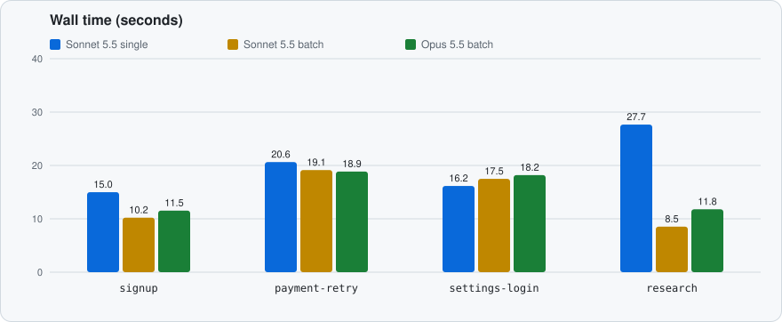
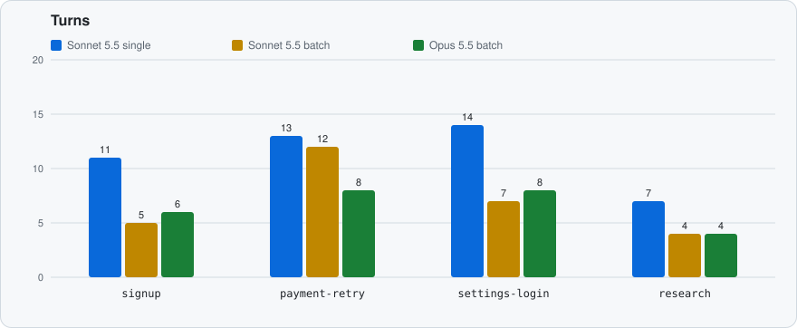
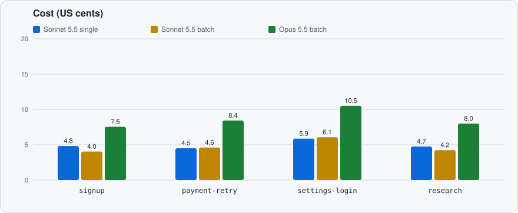

# Performance

How fast an AI agent finishes browser tasks through this MCP server, and what it costs. The numbers are for the current server, build `38d4ed2`, measured on 2026-10-04 with Chrome 154 headless, Node.js 24.20, and macOS 26.6 on Apple Silicon. Earlier builds' numbers are in this file's history.

Three series, 3 runs of each of the four [scenarios](#scenarios), 36 of 36 runs passed, $3.02 in total:

- **Sonnet 5.5 `single`**: `run_steps` and `run_tabs` are disallowed, so every action and check is its own tool call.
- **Sonnet 5.5 `batch`**: the full tool set, and the prompt does not mention batching.
- **Opus 5.5 `batch`**: the same, with Opus.

Both models ran at medium effort through Claude Code. Each chart bar is the median of the 3 runs.







## What the runs show

1. **Batching halves the turns.** With `run_steps`, Sonnet's `signup` takes 5 turns instead of 11, `settings-login` 7 instead of 14, and with `run_tabs`, `research` 4 instead of 7. Every `batch` run of `signup` and `settings-login` sent each form as one batch, and every `research` run opened the five articles in one `run_tabs` call. Wall time follows: 9.7 s against 15.9 s, 12.7 s against 20.5 s, and 9.0 s against 28.1 s.
2. **Every form run starts with `get_snapshot` and acts by ref.** All 27 `signup`, `payment-retry`, and `settings-login` runs, in every series, called it right after attaching and used `ref=` selectors for the fields and buttons. No run called `get_document` or `take_screenshot`. Opus also uses it as the check: it ends its batches with a `get_snapshot` step and takes a second snapshot after the cookie banner appears, so its `signup` runs look at the page twice and act once.
3. **Model time is most of the wall time.** Server time is under 2 s in every series except where a wait ran to its timeout, so needing fewer turns matters far more than faster tools.
4. **`payment-retry` is decided by how the agent waits.** The page has one button, so the snapshot saves nothing. Opus retried inside one `repeat` step in every run and finished in 8 turns. Sonnet handles each attempt in its own turns (12–13), and its `batch` median of 27.0 s hides one run that lost 20 s to a `wait_for` on `#pay` with `textExcludes: "Processing"` that reached its timeout; the `single` runs (16.3 s) happened not to.
5. **Without `run_tabs`, agents look for a shortcut.** Every `single` run of `research` first tried to `fetch()` the articles from the page with `evaluate_js`, which the browser blocks across origins, then navigated to them one by one; one run took 14 turns and 34 s.
6. **Opus costs 1.5–1.8 times Sonnet** per task at similar or fewer turns, and is 1.2–1.3 times slower on the form tasks, where its turns take longer. On `payment-retry` it is faster (21.6 s against 27.0 s) because it never waits on a timeout.
7. **Tool definitions are most of the input tokens.** The 39 tool definitions are 33.0k characters, sent (and cached) on every turn, so cost grows with turns more than with page content. A `get_snapshot` of the settings page is 6 lines; the same page from `get_document` is several kilobytes.

## Results

Median of 3 runs, with the range in parentheses when runs differ. The column meanings are under [Method](#method).

### Sonnet 5.5, medium effort, `single` mode

| Scenario         | OK  | Wall time              | Turns      | Tool calls | Server time          | Response chars      | Input tokens           | Output tokens    | Cost                   |
| ---------------- | --- | ---------------------- | ---------- | ---------- | -------------------- | ------------------- | ---------------------- | ---------------- | ---------------------- |
| `signup`         | 3/3 | 15.9 s (12.4 s–17.1 s) | 11 (11–12) | 10 (10–11) | 0.1 s (0.1 s–0.1 s)  | 9.7k (9.0k–12.4k)   | 100.9k (99.9k–117.6k)  | 1.1k (1.1k–1.2k) | $0.063 ($0.061–$0.108) |
| `payment-retry`  | 3/3 | 16.3 s (13.2 s–44.1 s) | 13 (12–13) | 12 (11–12) | 1.8 s (0.4 s–30.7 s) | 9.0k (7.1k–12.8k)   | 116.4k (113.1k–161.5k) | 1.3k (1.3k–1.5k) | $0.070 ($0.065–$0.075) |
| `settings-login` | 3/3 | 20.5 s (15.0 s–21.3 s) | 14 (13–15) | 13 (12–14) | 0.1 s (0.1 s–0.1 s)  | 12.4k (10.6k–13.5k) | 152.8k (152.0k–152.8k) | 1.5k (1.5k–1.6k) | $0.081 ($0.079–$0.082) |
| `research`       | 3/3 | 28.1 s (21.3 s–34.0 s) | 7 (6–14)   | 6 (5–13)   | 9.2 s (4.6 s–16.6 s) | 8.3k (6.8k–12.7k)   | 111.2k (94.7k–190.2k)  | 0.9k (0.8k–1.5k) | $0.055 ($0.054–$0.089) |

### Sonnet 5.5, medium effort, `batch` mode

| Scenario         | OK  | Wall time              | Turns     | Tool calls | Server time          | Response chars      | Input tokens           | Output tokens    | Cost                   |
| ---------------- | --- | ---------------------- | --------- | ---------- | -------------------- | ------------------- | ---------------------- | ---------------- | ---------------------- |
| `signup`         | 3/3 | 9.7 s (9.6 s–10.1 s)   | 5 (5–6)   | 4 (4–5)    | 0.1 s (0.1 s–0.1 s)  | 15.5k (12.7k–15.5k) | 93.4k (92.6k–93.4k)    | 0.7k (0.7k–0.8k) | $0.057 ($0.055–$0.109) |
| `payment-retry`  | 3/3 | 27.0 s (20.8 s–31.4 s) | 12 (7–13) | 11 (6–12)  | 7.1 s (1.5 s–20.1 s) | 8.2k (7.9k–8.2k)    | 129.1k (127.8k–184.5k) | 1.3k (0.8k–1.4k) | $0.068 ($0.058–$0.079) |
| `settings-login` | 3/3 | 12.7 s (12.3 s–17.7 s) | 7 (7–12)  | 6 (6–11)   | 0.1 s (0.1 s–0.2 s)  | 20.1k (17.3k–25.8k) | 139.6k (136.0k–157.2k) | 1.1k (1.0k–1.3k) | $0.082 ($0.075–$0.083) |
| `research`       | 3/3 | 9.0 s (8.7 s–11.3 s)   | 4         | 3          | 1.7 s (1.7 s–1.7 s)  | 10.7k (10.7k–10.7k) | 72.0k (72.0k–72.1k)    | 0.5k (0.5k–0.6k) | $0.047 ($0.047–$0.047) |

### Opus 5.5, medium effort, `batch` mode

| Scenario         | OK  | Wall time              | Turns    | Tool calls | Server time         | Response chars      | Input tokens           | Output tokens    | Cost                   |
| ---------------- | --- | ---------------------- | -------- | ---------- | ------------------- | ------------------- | ---------------------- | ---------------- | ---------------------- |
| `signup`         | 3/3 | 12.8 s (12.7 s–19.3 s) | 6 (5–6)  | 5 (4–5)    | 0.9 s (0.9 s–1.1 s) | 13.2k (12.9k–13.3k) | 92.8k (92.1k–92.8k)    | 0.7k (0.7k–0.7k) | $0.093 ($0.089–$0.200) |
| `payment-retry`  | 3/3 | 21.6 s (16.6 s–22.7 s) | 8 (8–10) | 7 (7–9)    | 3.0 s (2.8 s–3.1 s) | 20.2k (14.9k–28.7k) | 113.4k (112.6k–132.0k) | 1.1k (0.9k–1.4k) | $0.121 ($0.112–$0.122) |
| `settings-login` | 3/3 | 17.0 s (15.2 s–19.8 s) | 8 (7–8)  | 7 (6–7)    | 1.1 s (1.1 s–1.3 s) | 17.6k (17.4k–19.0k) | 133.5k (113.5k–136.2k) | 1.0k (1.0k–1.0k) | $0.119 ($0.112–$0.120) |
| `research`       | 3/3 | 11.4 s (11.3 s–11.5 s) | 4        | 3          | 1.7 s (1.7 s–1.7 s) | 10.7k (10.7k–10.7k) | 72.0k (72.0k–72.1k)    | 0.5k (0.5k–0.5k) | $0.081 ($0.081–$0.081) |

## Method

`bench/run.mjs` runs every scenario through headless Claude Code, or through the Codex CLI for `gpt-*` models, with a fresh MCP server per run.

- **Browser.** A throwaway headless Chrome with its own temporary profile, on port 9333, so benchmark runs never touch a real profile.
- **Pages.** `bench/fixture-server.mjs` serves the fixture pages from `bench/fixtures/` on loopback, with no network access. It keeps per-run state (what was submitted, how many attempts were made) so a run can be judged by what actually happened on the page.
- **Agent.** `claude -p` with `--model` and `--effort`, isolated from the machine it runs on: `--setting-sources ""` (no user or project `CLAUDE.md` or settings), `--strict-mcp-config` with only this server, `--tools ""` (no built-in tools such as Bash or Read), and `--allowedTools mcp__browser`. The runner opens the tab and gives the agent its URL and target id.
- **GPT models.** `codex exec --json` with `--ignore-user-config`, `--ephemeral`, a read-only sandbox, only this server (its tools approved in advance), and Codex's built-in browser, shell, web, app, and plugin tools turned off. Codex calls MCP tools through its code-mode `exec` tool, which stays on. Codex also loads the user's global `~/.codex/AGENTS.md` whatever the flags, so move that file aside for GPT runs.
- **Fixed overhead.** Answering "OK" with the same isolation and server takes 2.2–4.2 s through Claude Code and 4.1–8.6 s through Codex, so the CLI accounts for a few seconds of each run.
- **Modes.**
  - `single`: `run_steps` and `run_tabs` are disallowed, so every action and check is its own tool call.
  - `batch`: the full tool set, and the prompt does not mention batching.
  - `batch-hinted`: the full tool set, and the prompt asks the agent to prefer `run_steps` (the exact wording is `MODES` in `bench/run.mjs`).
- **Success.** Each scenario's `check` in `bench/scenarios.mjs` passes only if the fixture server recorded the right outcome (for example, the exact signup values, or a completed payment with no overlapping attempts) and the agent's reply contains the code the page showed at the end.
- **Repeats.** Model runs vary by several seconds between runs, so each scenario and mode runs several times. The tables show the median, with the range in parentheses when runs differ. Turns and server time vary less than wall time and are the more reliable signals.

Metrics in the tables:

- **Wall time**: from starting `claude -p` or `codex exec` until it exits.
- **Turns**: model turns reported by Claude Code. Codex does not report turns, so for GPT models it is tool calls plus the final answer.
- **Tool calls**: browser tool calls made by the agent.
- **Server time**: total time the server spent inside tool calls.
- **Response chars**: total text returned by the tools, a rough measure of how much the tools add to the context.
- **Input tokens**: uncached, cache-write, and cache-read input tokens added together.
- **Cost**: the `total_cost_usd` Claude Code reports. For GPT models, an estimate from OpenAI's list prices, since Codex under a ChatGPT login reports tokens but no cost.

### Running it

```sh
node bench/run.mjs --model claude-sonnet-5-5 --effort medium --repeats 3 --modes single
node bench/run.mjs --model claude-sonnet-5-5 --effort medium --repeats 3 --modes batch
node bench/run.mjs --model claude-opus-5-5 --effort medium --repeats 3 --modes batch
node bench/report.mjs --out docs/images bench/results/<run>.jsonl ...
```

`--scenarios` and `--modes` take comma-separated lists, and `--transcripts <dir>` saves each run's stream-json transcript there. Raw results go to `bench/results/`, which is not committed; each line records the build, model, effort, Chrome version, verdict, timings, token usage, tool calls, and the per-call server timings. `bench/report.mjs` prints the tables in this file from result files, in the order given, and with `--out` writes the three charts. The runner needs macOS Chrome at its default path, or `--chrome <path>`, and a logged-in `claude` CLI (or `codex` CLI for GPT models).

## Scenarios

The source of truth is `bench/scenarios.mjs` (task prompts and success checks) and `bench/fixtures/` (the pages). Every prompt starts with the tab's URL and target id and asks the agent to attach to it; except in `research`, it also asks the agent not to open other tabs. In `batch-hinted` mode, the `research` prompt also suggests `run_tabs`.

| Id               | What the agent must do                                                                                                                                                                                                                                       | Passes when                                                                                                                                    |
| ---------------- | ------------------------------------------------------------------------------------------------------------------------------------------------------------------------------------------------------------------------------------------------------------ | ---------------------------------------------------------------------------------------------------------------------------------------------- |
| `signup`         | Dismiss a cookie banner that covers the form 500 ms after load, fill in the name, email, and plan select, tick the terms checkbox, submit, wait for the account to be created (800 ms), and report the confirmation code.                                    | The server recorded exactly "Ada Lovelace", `ada@example.com`, the Pro plan, and accepted terms, and the reply contains the confirmation code. |
| `payment-retry`  | Pay, see the first two attempts get declined (1.2 s each), retry without starting a new attempt while one is processing, and report the receipt number from the third attempt.                                                                               | The payment completed, no attempts overlapped, and the reply contains the receipt number.                                                      |
| `settings-login` | Open settings, get redirected to a login form, sign in, come back, turn email notifications off and the weekly digest on, set the language to Japanese, save (600 ms), and report the revision shown after saving. The "saved" toast disappears after 2.5 s. | The saved settings match, and the reply contains the latest revision number.                                                                   |
| `research`       | From a results page listing five component overviews, find each component's release codename, near the end of its article. Each article takes 1.5 s to load and is served from a second origin without CORS headers.                                         | The reply contains all five random codenames in the listed order.                                                                              |
