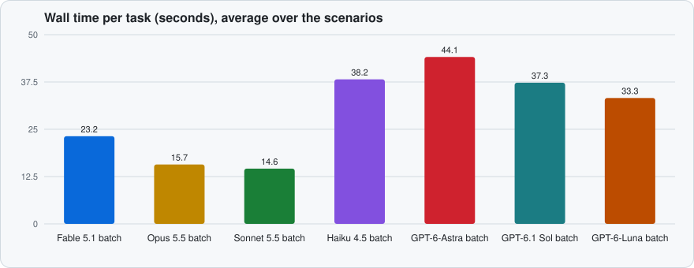
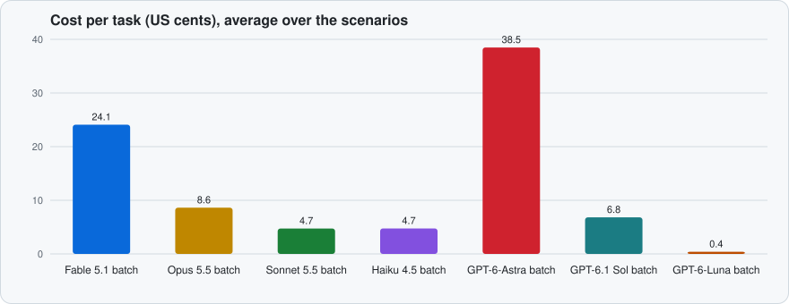
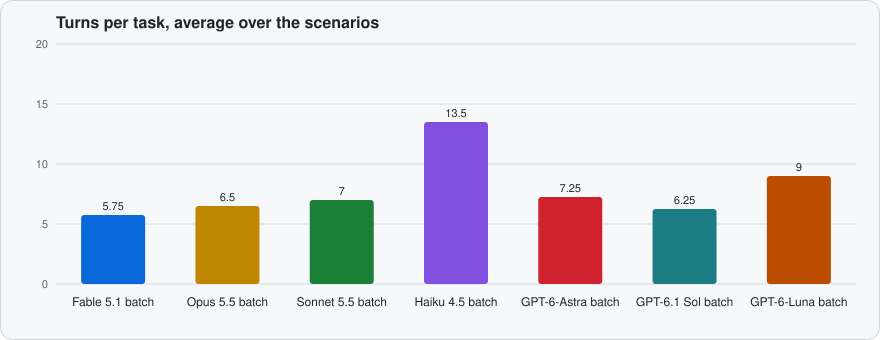

# Performance

How fast an AI agent finishes browser tasks through this MCP server, and what it costs. Every number here is for the current server, build `f00bf00`, measured on 2026-10-04 with Chrome 154 headless, Node.js 24.20, and macOS 26.6 on Apple Silicon. Earlier builds' numbers are in this file's history; the previous run, on build `38d4ed2`, is the "before" in the comparisons below.

Seven models at medium effort ran the four [scenarios](#scenarios) 3 times each with the default tool set (`batch` mode), and Sonnet 5.5 ran them again with one action per call (`single` mode): 96 runs, all passed, $11.72 in total. Haiku 4.5's `research` runs were repeated after a fixture fix (see [Method](#method)). Each chart bar is the median of 3 runs, or for a model's bar, the average over the scenarios of each scenario's median.

## Model comparison







Per task: the average over the four scenarios of each scenario's median wall time, turns, and cost; then each scenario's median wall time · turns · cost.

| Model       | Via         | OK    | Wall time | Turns | Cost     | `signup`              | `payment-retry`       | `settings-login`       | `research`            |
| ----------- | ----------- | ----- | --------- | ----- | -------- | --------------------- | --------------------- | ---------------------- | --------------------- |
| Fable 5.1   | Claude Code | 12/12 | 30.6 s    | 5.3   | $0.241   | 26.1 s · 4 · $0.232   | 32.9 s · 6 · $0.228   | 39.9 s · 7 · $0.278    | 23.3 s · 4 · $0.226   |
| Opus 5.5    | Claude Code | 12/12 | 15.1 s    | 6.5   | $0.086   | 11.5 s · 4 · $0.075   | 18.9 s · 9 · $0.084   | 18.2 s · 8 · $0.105    | 11.8 s · 5 · $0.080   |
| Sonnet 5.5  | Claude Code | 12/12 | 13.8 s    | 5.8   | $0.047   | 10.2 s · 4 · $0.040   | 19.1 s · 8 · $0.046   | 17.5 s · 7 · $0.061    | 8.5 s · 4 · $0.042    |
| Haiku 4.5   | Claude Code | 12/12 | 26.5 s    | 10.5  | $0.047   | 20.8 s · 7 · $0.041   | 21.2 s · 10 · $0.039  | 20.0 s · 7 · $0.037    | 44.0 s · 18 · $0.073  |
| GPT-6-Astra | Codex CLI   | 12/12 | 33.8 s    | 5.0   | $0.385\* | 27.6 s · 4 · $0.358\* | 48.4 s · 7 · $0.409\* | 29.9 s · 5 · $0.393\*  | 29.5 s · 4 · $0.380\* |
| GPT-6.1 Sol | Codex CLI   | 12/12 | 33.1 s    | 5.3   | $0.068\* | 26.2 s · 4 · $0.065\* | 39.5 s · 7 · $0.068\* | 35.2 s · 5 · $0.070\*  | 31.4 s · 5 · $0.070\* |
| GPT-6-Luna  | Codex CLI   | 12/12 | 27.2 s    | 6.5   | $0.004\* | 19.4 s · 4 · $0.003\* | 27.6 s · 7 · $0.004\* | 38.2 s · 10 · $0.006\* | 23.8 s · 5 · $0.004\* |

\* Estimated from OpenAI's standard list prices, because Codex under a ChatGPT login reports tokens but no cost.

1. **Every model costs less per task than on the previous build, and six of seven need fewer turns.** The default tool list is now 25 tools in 17.0k characters, against 39 tools in 33.0k, and it is sent on every turn. Sonnet 5.5 went from $0.063 to $0.047 and from 7.0 to 5.8 turns; Haiku 4.5 from 13.5 to 10.5 turns; GPT-6-Astra from 7.2 to 5.0; GPT-6-Luna from 9.0 to 6.5. Opus 5.5 stayed at 6.5 turns, at $0.086 instead of $0.104.
2. **Sonnet 5.5 is the fastest and, with Haiku 4.5, the cheapest Claude model**: 13.8 s and $0.047 per task. Opus 5.5 takes 15.1 s at 1.8 times the cost.
3. **Clicks now wait for the outcome, so `payment-retry` needs no waits.** Each click on Pay returns after about 1.4 s, once the page has settled, with what changed: the decline message or the receipt. Most runs clicked three times and read the result from each reply; no GPT run of it used `wait_for`. Sonnet's `batch` median fell from 27.0 s to 19.1 s. Fable 5.1 retried inside one `repeat` step in every run, and Opus 5.5 in one of three.
4. **Fable 5.1 takes few turns (5.3) but is the slowest Claude model, 30.6 s per task at 2.8 times Opus's cost.** Its turns average 6.1 s, against 2.4–2.6 s for the other Claude models, and it gained nothing over Opus on these tasks.
5. **Haiku 4.5 passes everything but is slow on `research`**: no run used `run_tabs`, and each clicked through the five articles one at a time, in 17–19 turns and 38–46 s.
6. **The GPT models are slower per turn**, 6.2–6.5 s for GPT-6-Astra and GPT-6.1 Sol and 4.1 s for GPT-6-Luna, so they take 27–34 s per task even on 5.0–6.5 turns. The Codex CLI's own startup accounts for 4–9 s of each run (see [Method](#method)).
7. **The dropped-input case came back, only in GPT runs.** In all three GPT-6-Luna `settings-login` runs and one GPT-6.1 Sol run, the first click on the settings page after the login redirect failed with "the browser delivered no input events", even after the automatic resend. The agents finished the form with `evaluate_js`, which is why Luna's `settings-login` takes 10 turns and why Luna used `evaluate_js` 12 times. None of the 15 Claude `settings-login` runs hit it.
8. **GPT-6-Astra is the most expensive**, an estimated $0.385 per task. GPT-6.1 Sol falls between Sonnet and Opus ($0.068), and GPT-6-Luna costs about a twelfth of Haiku ($0.004).
9. **No run needed a tool outside the default set**, and none called `more_tools`.

## Batching

Sonnet 5.5 with one action per call (`single`: `run_steps` and `run_tabs` disallowed) against Sonnet and Opus with the default tool set:


1. **Batching still cuts turns on forms and research.** With `run_steps`, Sonnet's `signup` takes 4 turns instead of 9 and `settings-login` 7 instead of 11; with `run_tabs`, `research` takes 4 instead of 6. Wall time follows for `signup` (10.2 s against 15.0 s) and `research` (8.5 s against 27.7 s), but not for `settings-login` (17.5 s against 16.2 s).
2. **One action per call got cheaper too.** Actions now report what changed once the page settles, so fewer separate checks are needed: on the previous build `single` mode took 11, 13, 14, and 7 turns, and now 9, 8, 11, and 6. In `payment-retry`, `single` and `batch` both take 8 turns.
3. **Server time went up, and turns went down.** An action now waits until the page settles (the DOM quiet for 150 ms, and the requests and short timers it started finished), so a form batch spends 1–2 s in the server instead of 0.1–0.9 s, and a Pay click 1.4 s. That is time an agent used to spend on `wait_for` calls and extra turns. Model time is still most of the wall time, except in `single` runs of `research`, where loading the slow articles one by one takes 11–15 s of server time.
4. **Without `run_tabs`, agents look for a shortcut.** Every `single` run of `research` first tried to `fetch()` the articles from the page with `evaluate_js`, which the browser blocks across origins, then navigated to them one by one.
5. **Tool definitions are a large share of the input tokens.** They are sent (and cached) on every turn, so cost grows with turns more than with page content. A `get_snapshot` of the settings page is 6 lines; the same page from `get_document` is several kilobytes.

## Results

Median of 3 runs, with the range in parentheses when runs differ. The column meanings are under [Method](#method).

### Sonnet 5.5, medium effort, `single` mode

| Scenario         | OK  | Wall time              | Turns      | Tool calls | Server time            | Response chars      | Input tokens         | Output tokens    | Cost                   |
| ---------------- | --- | ---------------------- | ---------- | ---------- | ---------------------- | ------------------- | -------------------- | ---------------- | ---------------------- |
| `signup`         | 3/3 | 15.0 s (10.7 s–29.2 s) | 9          | 8          | 2.0 s (2.0 s–2.0 s)    | 9.5k (9.5k–9.5k)    | 57.7k (57.6k–57.8k)  | 0.9k (0.9k–0.9k) | $0.048 ($0.048–$0.074) |
| `payment-retry`  | 3/3 | 20.6 s (18.3 s–21.7 s) | 8 (8–10)   | 7 (7–9)    | 4.2 s (4.2 s–4.2 s)    | 5.6k (5.6k–6.3k)    | 76.9k (76.3k–77.6k)  | 0.8k (0.7k–0.9k) | $0.045 ($0.044–$0.049) |
| `settings-login` | 3/3 | 16.2 s (14.1 s–16.6 s) | 11 (10–11) | 10 (9–10)  | 2.8 s (2.8 s–2.8 s)    | 10.9k (10.6k–10.9k) | 85.6k (70.9k–86.0k)  | 1.1k (1.0k–1.1k) | $0.059 ($0.054–$0.059) |
| `research`       | 3/3 | 27.7 s (24.5 s–34.0 s) | 6 (6–14)   | 5 (5–13)   | 15.1 s (10.6 s–15.2 s) | 8.6k (8.3k–12.1k)   | 66.9k (66.6k–123.9k) | 0.8k (0.8k–1.5k) | $0.047 ($0.047–$0.076) |

### Fable 5.1, medium effort, `batch` mode

| Scenario         | OK  | Wall time              | Turns   | Tool calls | Server time         | Response chars      | Input tokens           | Output tokens    | Cost                   |
| ---------------- | --- | ---------------------- | ------- | ---------- | ------------------- | ------------------- | ---------------------- | ---------------- | ---------------------- |
| `signup`         | 3/3 | 26.1 s (20.4 s–29.1 s) | 4 (4–5) | 3 (3–4)    | 1.1 s (1.1 s–1.3 s) | 11.9k (11.9k–12.4k) | 56.3k (56.3k–73.2k)    | 0.6k (0.6k–0.6k) | $0.232 ($0.218–$0.378) |
| `payment-retry`  | 3/3 | 32.9 s (31.0 s–53.4 s) | 6       | 5          | 4.2 s (4.2 s–4.2 s) | 11.4k (11.4k–15.0k) | 83.4k (70.8k–83.5k)    | 0.8k (0.7k–0.9k) | $0.228 ($0.223–$0.239) |
| `settings-login` | 3/3 | 39.9 s (31.7 s–54.3 s) | 7       | 6          | 2.1 s (2.1 s–2.1 s) | 15.3k (15.3k–17.6k) | 107.9k (107.8k–110.4k) | 0.9k (0.9k–1.1k) | $0.278 ($0.275–$0.301) |
| `research`       | 3/3 | 23.3 s (21.3 s–28.4 s) | 4       | 3          | 1.7 s (1.7 s–1.7 s) | 11.0k (10.7k–11.0k) | 56.9k (56.8k–56.9k)    | 0.6k (0.6k–0.6k) | $0.226 ($0.220–$0.226) |

### Opus 5.5, medium effort, `batch` mode

| Scenario         | OK  | Wall time              | Turns   | Tool calls | Server time          | Response chars      | Input tokens        | Output tokens    | Cost                   |
| ---------------- | --- | ---------------------- | ------- | ---------- | -------------------- | ------------------- | ------------------- | ---------------- | ---------------------- |
| `signup`         | 3/3 | 11.5 s (10.6 s–13.9 s) | 4 (4–5) | 3 (3–4)    | 1.1 s (1.1 s–1.1 s)  | 11.9k               | 48.6k (48.5k–49.1k) | 0.5k (0.5k–0.6k) | $0.075 ($0.072–$0.135) |
| `payment-retry`  | 3/3 | 18.9 s (17.2 s–38.7 s) | 9 (7–9) | 8 (6–8)    | 4.2 s (4.1 s–23.1 s) | 7.9k (5.4k–14.7k)   | 87.1k (61.9k–87.3k) | 0.8k (0.8k–0.9k) | $0.084 ($0.079–$0.088) |
| `settings-login` | 3/3 | 18.2 s (17.3 s–18.4 s) | 8 (7–9) | 7 (6–8)    | 1.9 s (1.9 s–2.1 s)  | 16.0k (16.0k–16.0k) | 95.8k (95.1k–96.2k) | 0.9k (0.8k–1.0k) | $0.105 ($0.101–$0.109) |
| `research`       | 3/3 | 11.8 s (11.4 s–13.7 s) | 5       | 4          | 1.7 s (1.7 s–1.7 s)  | 10.7k (10.7k–10.7k) | 49.8k (49.8k–49.9k) | 0.6k (0.6k–0.7k) | $0.080 ($0.080–$0.080) |

### Sonnet 5.5, medium effort, `batch` mode

| Scenario         | OK  | Wall time              | Turns   | Tool calls | Server time         | Response chars      | Input tokens        | Output tokens    | Cost                   |
| ---------------- | --- | ---------------------- | ------- | ---------- | ------------------- | ------------------- | ------------------- | ---------------- | ---------------------- |
| `signup`         | 3/3 | 10.2 s (8.2 s–11.3 s)  | 4       | 3          | 1.1 s (1.1 s–1.1 s) | 11.9k (11.9k–11.9k) | 48.6k (48.6k–48.6k) | 0.5k (0.5k–0.5k) | $0.040 ($0.040–$0.071) |
| `payment-retry`  | 3/3 | 19.1 s (13.8 s–21.8 s) | 8 (6–8) | 7 (5–7)    | 4.2 s (4.2 s–4.2 s) | 5.6k (4.8k–5.6k)    | 85.2k (71.4k–85.3k) | 0.7k (0.5k–0.7k) | $0.046 ($0.039–$0.046) |
| `settings-login` | 3/3 | 17.5 s (16.0 s–18.5 s) | 7       | 6          | 2.1 s (1.9 s–2.1 s) | 16.0k (15.4k–16.0k) | 93.9k (93.8k–95.7k) | 0.9k (0.8k–0.9k) | $0.061 ($0.060–$0.061) |
| `research`       | 3/3 | 8.5 s (8.4 s–9.4 s)    | 4       | 3          | 1.7 s (1.7 s–1.7 s) | 10.7k (10.7k–10.7k) | 49.3k (49.2k–49.3k) | 0.5k (0.5k–0.5k) | $0.042 ($0.042–$0.043) |

### Haiku 4.5, medium effort, `batch` mode

| Scenario         | OK  | Wall time              | Turns      | Tool calls | Server time          | Response chars      | Input tokens           | Output tokens    | Cost                   |
| ---------------- | --- | ---------------------- | ---------- | ---------- | -------------------- | ------------------- | ---------------------- | ---------------- | ---------------------- |
| `signup`         | 3/3 | 20.8 s (11.7 s–22.0 s) | 7 (4–8)    | 6 (3–7)    | 1.8 s (1.1 s–3.9 s)  | 16.9k (11.9k–18.3k) | 109.9k (57.2k–125.7k)  | 1.5k (0.9k–1.6k) | $0.041 ($0.026–$0.054) |
| `payment-retry`  | 3/3 | 21.2 s (17.4 s–40.1 s) | 10 (8–14)  | 9 (7–13)   | 4.3 s (4.3 s–16.3 s) | 6.7k (6.0k–6.9k)    | 149.3k (116.6k–213.2k) | 1.4k (1.2k–2.0k) | $0.039 ($0.034–$0.049) |
| `settings-login` | 3/3 | 20.0 s (18.8 s–20.3 s) | 7 (7–8)    | 6 (6–7)    | 2.0 s (1.9 s–2.6 s)  | 15.6k (14.3k–16.1k) | 108.1k (107.8k–126.6k) | 1.4k (1.4k–1.5k) | $0.037 ($0.036–$0.040) |
| `research`       | 3/3 | 44.0 s (38.4 s–46.3 s) | 18 (17–19) | 17 (16–18) | 9.4 s (9.4 s–11.4 s) | 24.0k (23.7k–24.7k) | 318.7k (298.4k–337.6k) | 2.6k (2.4k–2.7k) | $0.073 ($0.069–$0.076) |

### GPT-6-Astra, medium effort, `batch` mode

| Scenario         | OK  | Wall time              | Turns   | Tool calls | Server time         | Response chars      | Input tokens           | Output tokens    | Cost                   |
| ---------------- | --- | ---------------------- | ------- | ---------- | ------------------- | ------------------- | ---------------------- | ---------------- | ---------------------- |
| `signup`         | 3/3 | 27.6 s (24.9 s–30.5 s) | 4       | 3          | 1.1 s (1.1 s–1.1 s) | 11.9k               | 98.3k (98.2k–98.4k)    | 0.3k (0.3k–0.3k) | $0.358 ($0.357–$0.358) |
| `payment-retry`  | 3/3 | 48.4 s (39.5 s–49.5 s) | 7       | 6          | 4.2 s (4.2 s–4.3 s) | 5.0k (5.0k–5.1k)    | 162.8k (140.3k–162.8k) | 0.4k (0.4k–0.4k) | $0.409 ($0.408–$0.570) |
| `settings-login` | 3/3 | 29.9 s (27.8 s–30.6 s) | 5       | 4          | 1.9 s (1.9 s–1.9 s) | 13.8k (13.8k–13.8k) | 122.9k (120.5k–123.0k) | 0.4k (0.4k–0.4k) | $0.393 ($0.373–$0.397) |
| `research`       | 3/3 | 29.5 s (28.3 s–29.6 s) | 4 (4–5) | 3 (3–4)    | 1.7 s (1.7 s–1.7 s) | 10.6k (10.2k–11.0k) | 100.9k (98.9k–119.8k)  | 0.3k (0.3k–0.3k) | $0.380 ($0.364–$0.445) |

### GPT-6.1 Sol, medium effort, `batch` mode

| Scenario         | OK  | Wall time              | Turns   | Tool calls | Server time         | Response chars      | Input tokens           | Output tokens    | Cost                   |
| ---------------- | --- | ---------------------- | ------- | ---------- | ------------------- | ------------------- | ---------------------- | ---------------- | ---------------------- |
| `signup`         | 3/3 | 26.2 s (25.0 s–27.4 s) | 4       | 3          | 1.1 s (1.1 s–1.1 s) | 11.9k (11.9k–11.9k) | 98.5k (98.5k–98.6k)    | 0.3k (0.3k–0.3k) | $0.065 ($0.064–$0.084) |
| `payment-retry`  | 3/3 | 39.5 s (37.7 s–41.4 s) | 7       | 6          | 4.3 s (4.3 s–4.3 s) | 5.0k                | 163.1k (163.0k–163.2k) | 0.4k (0.4k–0.4k) | $0.068 ($0.068–$0.087) |
| `settings-login` | 3/3 | 35.2 s (29.6 s–51.8 s) | 5 (5–8) | 4 (4–7)    | 1.9 s (1.9 s–3.2 s) | 13.8k (11.6k–13.8k) | 123.4k (123.1k–199.1k) | 0.4k (0.4k–0.6k) | $0.070 ($0.070–$0.129) |
| `research`       | 3/3 | 31.4 s (27.2 s–34.8 s) | 5       | 4          | 1.7 s (1.7 s–1.7 s) | 11.5k (11.5k–11.8k) | 123.5k (122.9k–125.5k) | 0.4k (0.3k–0.4k) | $0.070 ($0.070–$0.072) |

### GPT-6-Luna, medium effort, `batch` mode

| Scenario         | OK  | Wall time              | Turns      | Tool calls | Server time         | Response chars      | Input tokens           | Output tokens    | Cost                   |
| ---------------- | --- | ---------------------- | ---------- | ---------- | ------------------- | ------------------- | ---------------------- | ---------------- | ---------------------- |
| `signup`         | 3/3 | 19.4 s (17.9 s–24.3 s) | 4 (4–5)    | 3 (3–4)    | 1.1 s (1.1 s–3.3 s) | 11.9k (11.9k–13.7k) | 95.4k (95.3k–120.6k)   | 0.4k (0.3k–0.4k) | $0.003 ($0.003–$0.004) |
| `payment-retry`  | 3/3 | 27.6 s (25.5 s–31.1 s) | 7          | 6          | 4.3 s (4.2 s–4.3 s) | 5.0k (4.9k–6.1k)    | 157.9k (157.7k–159.2k) | 0.5k (0.4k–0.5k) | $0.004 ($0.004–$0.005) |
| `settings-login` | 3/3 | 38.2 s (34.9 s–44.8 s) | 10 (10–11) | 9 (9–10)   | 2.4 s (2.4 s–2.4 s) | 9.9k (9.9k–14.3k)   | 247.8k (243.4k–269.7k) | 0.9k (0.9k–1.0k) | $0.006 ($0.005–$0.006) |
| `research`       | 3/3 | 23.8 s (19.7 s–24.3 s) | 5          | 4          | 1.7 s (1.7 s–1.7 s) | 10.4k (10.3k–10.4k) | 138.7k (116.3k–139.8k) | 0.5k (0.4k–0.5k) | $0.004 ($0.004–$0.004) |

## Method

`bench/run.mjs` runs every scenario through headless Claude Code, or through the Codex CLI for `gpt-*` models, with a fresh MCP server per run.

- **Browser.** A throwaway headless Chrome with its own temporary profile, on port 9333, so benchmark runs never touch a real profile.
- **Pages.** `bench/fixture-server.mjs` serves the fixture pages from `bench/fixtures/` on loopback, with no network access. It keeps per-run state (what was submitted, how many attempts were made) so a run can be judged by what actually happened on the page. Until `275faa1`, an article's "Back to results" link dropped the run id, so an agent that clicked back and forth read another run's codenames; Haiku 4.5 does that, and its `research` runs here were made after the fix.
- **Agent.** `claude -p` with `--model` and `--effort`, isolated from the machine it runs on: `--setting-sources ""` (no user or project `CLAUDE.md` or settings), `--strict-mcp-config` with only this server, `--tools ""` (no built-in tools such as Bash or Read), and `--allowedTools mcp__browser`. The runner opens the tab and gives the agent its URL and target id.
- **GPT models.** `codex exec --json` with `--ignore-user-config`, `--ephemeral`, a read-only sandbox, only this server (its tools approved in advance), and Codex's built-in browser, shell, web, app, and plugin tools turned off. Codex calls MCP tools through its code-mode `exec` tool, which stays on. Codex also loads the user's global `~/.codex/AGENTS.md` whatever the flags, so that file was moved aside during the GPT runs, matching the Claude runs, which load no user instructions.
- **Fixed overhead.** Answering "OK" with the same isolation and server takes 2.2–4.2 s through Claude Code and 4.1–8.6 s through Codex, so the CLI accounts for a few seconds of each run, not the gap between the models.
- **Modes.**
  - `single`: `run_steps` and `run_tabs` are disallowed, so every action and check is its own tool call.
  - `batch`: the default tool set (`MCP_BROWSER_TOOLS` unset), and the prompt does not mention batching.
  - `batch-hinted`: the default tool set, and the prompt asks the agent to prefer `run_steps` (the exact wording is `MODES` in `bench/run.mjs`).
- **Success.** Each scenario's `check` in `bench/scenarios.mjs` passes only if the fixture server recorded the right outcome (for example, the exact signup values, or a completed payment with no overlapping attempts) and the agent's reply contains the code the page showed at the end.
- **Repeats.** Model runs vary by several seconds between runs, so each scenario and mode runs several times. The tables show the median, with the range in parentheses when runs differ. Turns and server time vary less than wall time and are the more reliable signals.

Metrics in the tables:

- **Wall time**: from starting `claude -p` or `codex exec` until it exits.
- **Turns**: model turns reported by Claude Code. Codex does not report turns, so for GPT models it is tool calls plus the final answer.
- **Tool calls**: browser tool calls made by the agent.
- **Server time**: total time the server spent inside tool calls.
- **Response chars**: total text returned by the tools, a rough measure of how much the tools add to the context.
- **Input tokens**: uncached, cache-write, and cache-read input tokens added together.
- **Cost**: the `total_cost_usd` Claude Code reports. For GPT models, an estimate from OpenAI's standard short-context list prices on 2026-09-30 (per 1M tokens: GPT-6-Astra $10.00 input, $1.00 cached input, $50.00 output; GPT-6.1 Sol $2.00, $0.10, $10.00; GPT-6-Luna $0.10, $0.01, $0.50), counting reasoning tokens as output.

### Running it

```sh
node bench/run.mjs --model claude-sonnet-5-5 --effort medium --repeats 3 --modes single
node bench/run.mjs --model claude-sonnet-5-5 --effort medium --repeats 3 --modes batch
node bench/run.mjs --model gpt-6.1-sol --effort medium --repeats 3 --modes batch
node bench/report.mjs --out docs/images bench/results/<single>.jsonl bench/results/<batch>.jsonl ...
node bench/report.mjs --out docs/images --per-model bench/results/<model>.jsonl ...
```

`--scenarios` and `--modes` take comma-separated lists, and `--transcripts <dir>` saves each run's stream-json transcript there. Raw results go to `bench/results/`, which is not committed; each line records the build, model, effort, Chrome version, verdict, timings, token usage, tool calls, and the per-call server timings. `bench/report.mjs` prints the tables in this file from result files, in the order given; with `--out` it writes the per-scenario charts, and with `--per-model` the per-model charts instead. The runner needs macOS Chrome at its default path, or `--chrome <path>`, and a logged-in `claude` CLI (or `codex` CLI for GPT models).

## Scenarios

The source of truth is `bench/scenarios.mjs` (task prompts and success checks) and `bench/fixtures/` (the pages). Every prompt starts with the tab's URL and target id and asks the agent to attach to it; except in `research`, it also asks the agent not to open other tabs. In `batch-hinted` mode, the `research` prompt also suggests `run_tabs`.

| Id               | What the agent must do                                                                                                                                                                                                                                       | Passes when                                                                                                                                    |
| ---------------- | ------------------------------------------------------------------------------------------------------------------------------------------------------------------------------------------------------------------------------------------------------------ | ---------------------------------------------------------------------------------------------------------------------------------------------- |
| `signup`         | Dismiss a cookie banner that covers the form 500 ms after load, fill in the name, email, and plan select, tick the terms checkbox, submit, wait for the account to be created (800 ms), and report the confirmation code.                                    | The server recorded exactly "Ada Lovelace", `ada@example.com`, the Pro plan, and accepted terms, and the reply contains the confirmation code. |
| `payment-retry`  | Pay, see the first two attempts get declined (1.2 s each), retry without starting a new attempt while one is processing, and report the receipt number from the third attempt.                                                                               | The payment completed, no attempts overlapped, and the reply contains the receipt number.                                                      |
| `settings-login` | Open settings, get redirected to a login form, sign in, come back, turn email notifications off and the weekly digest on, set the language to Japanese, save (600 ms), and report the revision shown after saving. The "saved" toast disappears after 2.5 s. | The saved settings match, and the reply contains the latest revision number.                                                                   |
| `research`       | From a results page listing five component overviews, find each component's release codename, near the end of its article. Each article takes 1.5 s to load and is served from a second origin without CORS headers.                                         | The reply contains all five random codenames in the listed order.                                                                              |
