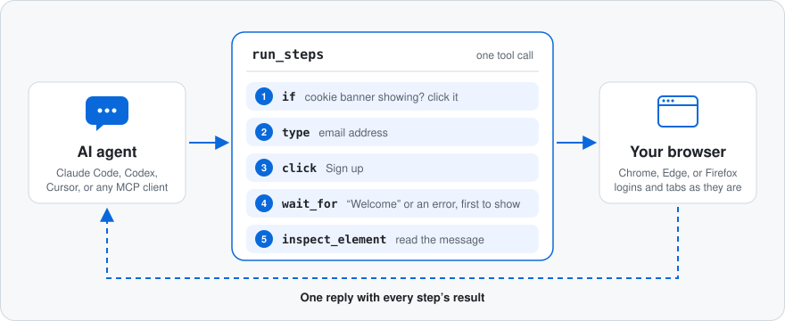
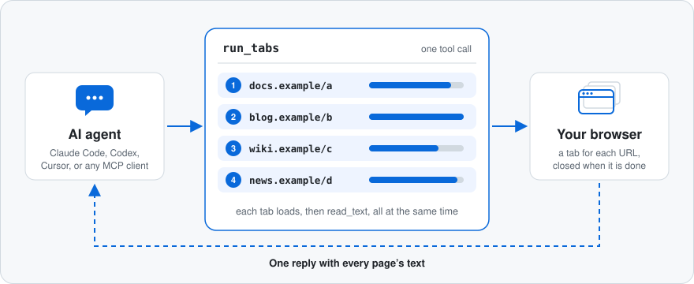

# mcp-browser-dev-tools

[](https://www.npmjs.com/package/mcp-browser-dev-tools)
[](https://www.npmjs.com/package/mcp-browser-dev-tools)

Let an AI agent work in a real browser with fewer back-and-forths. It sends a whole sequence of clicks, typing, waits, and checks in one tool call and gets every result back together, in your Chrome, Edge, or Firefox.

## Quick Start

You need Node.js 24 or later. Register the server with your MCP client:

```bash
# Claude Code
claude mcp add browser-devtools --scope user -- npx -y mcp-browser-dev-tools serve

# Codex
codex mcp add browser-devtools -- npx -y mcp-browser-dev-tools serve
```

Cursor and other clients that use an `mcpServers` config:

```json
{
  "mcpServers": {
    "browser-devtools": {
      "command": "npx",
      "args": ["-y", "mcp-browser-dev-tools", "serve"]
    }
  }
}
```

Then ask the agent for browser work, for example "open example.com and check the console for errors" or "attach to my open tab and find out why the form won't submit". The agent starts with `ensure_browser`, which reuses a browser that is already running with a debugging port, or launches one. To make launches use a particular profile, set `MCP_BROWSER_USER_DATA_DIR`; see [Configuration](docs/configuration.md) for this, native Windows, WSL, and Firefox.

## What It Does



Your agent gets 38 browser tools over MCP: open or attach to tabs, click, type, and navigate, read the console and network, take screenshots, and save and restore sessions. At the center is `run_steps`: the agent sends a whole task, with branches and waits in it, and the server carries it out in the browser and replies once. `run_tabs` does the same in several tabs at the same time.

## Why This One

- **Fewer round trips.** Every model turn costs thinking time and tokens, so the agent does more with each call. In our benchmark, batching halved the turns Sonnet 5.5 needed to sign up through a form.
- **Many pages at once.** Research over several pages happens side by side: `run_tabs` opens them together and `read_text` brings back what they say. In our benchmark, reading five slow pages took Sonnet 5.5 8.4 s and 4 turns instead of 28 s and 14.
- **Calm on real pages.** Waits end on whichever outcome shows up, actions wait out a covering banner or a button that isn't enabled yet, and if a step fails the reply lists the page's controls, so the next try is an informed one.
- **Right where you work.** It attaches to the browser you already use, with its logins, tabs, and extensions, and speaks to Chrome, Edge, and Firefox with the same tools.
- **A debugger at hand.** Console messages with stack traces, network requests and HAR export, cookies and storage, and a one-call debug report.

## One Call, Start To Finish

A `run_steps` call that dismisses a cookie banner if one is showing, fills in and submits a form, waits for either the success or the error message, and reads it:

```json
{
  "sessionId": "chromium:1f0c…",
  "steps": [
    {
      "tool": "if",
      "arguments": {
        "condition": { "selector": "text=Accept cookies" },
        "then": [
          {
            "tool": "click",
            "arguments": { "selector": "text=Accept cookies" }
          }
        ]
      }
    },
    {
      "tool": "type",
      "arguments": {
        "selector": "role=textbox[name=\"Email\"]",
        "text": "ada@example.com"
      }
    },
    {
      "tool": "click",
      "arguments": { "selector": "role=button[name=\"Sign up\"]" }
    },
    {
      "tool": "wait_for",
      "arguments": {
        "anyOf": [
          { "selector": "#message", "textIncludes": "Welcome" },
          { "selector": "#message", "textIncludes": "error" }
        ]
      }
    },
    { "tool": "inspect_element", "arguments": { "selector": "#message" } }
  ]
}
```

The result has each step's outcome: which branch the `if` took, which `anyOf` alternative matched, and the message element with its text. Locators can be CSS, `text=`, `role=` with an accessible name, or `name=`. The full semantics of `run_steps`, `if`, `repeat`, and conditions are in [Tools](docs/tools.md#batched-steps).

## Many Pages At Once



A research step usually means opening several pages and reading each one. `read_text` with `links: true` collects the result links from a search page; then one `run_tabs` call opens them all and reads them side by side:

```json
{
  "browserFamily": "chromium",
  "tabs": [
    {
      "url": "https://docs.example.com/a",
      "steps": [{ "tool": "read_text", "arguments": { "maxChars": 4000 } }]
    },
    {
      "url": "https://blog.example.com/b",
      "steps": [{ "tool": "read_text", "arguments": { "maxChars": 4000 } }]
    },
    {
      "url": "https://news.example.com/d",
      "steps": [
        { "tool": "wait_for", "arguments": { "selector": "article" } },
        {
          "tool": "read_text",
          "arguments": { "selector": "article", "maxChars": 4000 }
        }
      ]
    }
  ]
}
```

The result lists every tab in the order given, each with its steps' results: here, each page's main text, cut to `maxChars`. Each tab opens a new tab, loads its URL, and runs its steps at the same time as the others, so the call takes about as long as the slowest page; the tabs close afterwards. Steps are the same as in `run_steps`, including `if` and `repeat`, and a tab that fails or runs past its `timeoutMs` does not stop the others. `browserFamily` picks the browser for the new tabs when the server runs in its default `auto` mode. The details are in [Tools](docs/tools.md#several-tabs-at-once).

## Measured

Model turns per task, median of 3 runs, from the benchmark in [PERFORMANCE.md](PERFORMANCE.md):

| Task                                | Sonnet 5.5, one action per call | Sonnet 5.5 with `run_steps` | Opus 5.5 with `run_steps` |
| ----------------------------------- | ------------------------------- | --------------------------- | ------------------------- |
| Sign up through a form              | 10                              | 5                           | 4                         |
| Pay, retrying declined attempts     | 12                              | 11                          | 4                         |
| Sign in, then change settings       | 16                              | 9                           | 7                         |
| Read five pages from a results list | 14                              | 4                           | 4                         |

Opus retried the payment inside a single `repeat` step. The last row uses `run_tabs` in place of `run_steps`. Seven models (Claude Fable 5.1, Opus 5.5, Sonnet 5.5, and Haiku 4.5; GPT-6-Astra, GPT-6.1 Sol, and GPT-6-Luna) completed all 63 runs of the first three tasks; PERFORMANCE.md has the time, cost, and turns for each, and how the runs were set up.

## Tools

38 tools, described in [docs/tools.md](docs/tools.md):

- **Browser and tabs:** `browser_status`, `ensure_browser`, `launch_browser`, `list_tabs`, `new_tab`, `close_tab`, `attach_tab`, `detach_tab`, `list_sessions`
- **Act:** `navigate`, `reload`, `click`, `hover`, `type`, `select`, `press_key`, `scroll`, `set_viewport`
- **Wait and batch:** `wait_for`, `run_steps`, `run_tabs`
- **Inspect:** `get_page_state`, `get_document`, `inspect_element`, `read_text`, `take_screenshot`, `evaluate_js`
- **Console and network:** `get_console_messages`, `get_network_requests`, `get_events`, `get_har`
- **Session state:** `get_cookies`, `get_storage`, `capture_session_snapshot`, `restore_session_snapshot`, `compare_page_state`, `compare_selector`, `capture_debug_report`

## Configuration

The defaults work for most setups: the server finds a Chromium or Firefox debugging endpoint on loopback ports 9222–9226, or launches a browser when asked. The settings people change most:

- `MCP_BROWSER_FAMILY`: `auto` (default), `chromium`, `edge`, or `firefox`
- `CDP_BASE_URL` and `FIREFOX_BIDI_WS_URL`: fixed browser endpoints
- `MCP_BROWSER_USER_DATA_DIR`: the profile to launch browsers with
- `MCP_BROWSER_ENABLE_EVAL=0`: turn off page JavaScript from the agent (`evaluate_js` and `expression` conditions)

Every setting, per-client examples, and how the server reuses or launches browsers are in [docs/configuration.md](docs/configuration.md). WSL with a Windows browser, and other platform walkthroughs, are in [docs/setup.md](docs/setup.md).

## Safety

- The server only connects to loopback browser endpoints unless you set `MCP_BROWSER_ALLOW_REMOTE_ENDPOINTS=1`.
- Tools both read and act on the page: they click, type, navigate, and run page JavaScript through `evaluate_js`, as whoever the browser profile is signed in as. Point the server at a profile you are willing to let an agent use.
- `MCP_BROWSER_ENABLE_EVAL=0` removes `evaluate_js` and the `expression` field of `wait_for` and `run_steps` conditions. This narrows the tool surface rather than drawing a security boundary: the other tools already read cookies and storage and can navigate anywhere. To approve page scripts one at a time, use your MCP client's tool permissions, and note that `wait_for` and `run_steps` calls can carry scripts too.

## Compared With Playwright

Playwright is the better choice for deterministic automation and end-to-end tests, with its assertions, tracing, and CI tooling. This server is for a different job: letting an AI agent inspect and operate a live browser through MCP. The agent calls a fixed set of tools instead of writing and running scripts, can work in the tab and session you already have open, and uses the same tools on Chromium and Firefox.

## Documentation

- [Tools](docs/tools.md): every tool, locator syntax, and `run_steps` in full
- [Configuration](docs/configuration.md): MCP clients, browser launching and profiles, environment variables
- [Manual Verification And Troubleshooting](docs/setup.md): Windows, WSL, Linux, and macOS walkthroughs
- [Performance](PERFORMANCE.md): benchmark method and results across models
- [Architecture](docs/architecture.md)
- [Changelog](CHANGELOG.md)

## Development

```bash
corepack enable
pnpm install
pnpm run check
pnpm run pack:check
```

The repository uses `pnpm` for development and CI; the package is published to npm. See [Publishing](PUBLISHING.md) and [Repository Settings](docs/repository-settings.md) for the release process.
